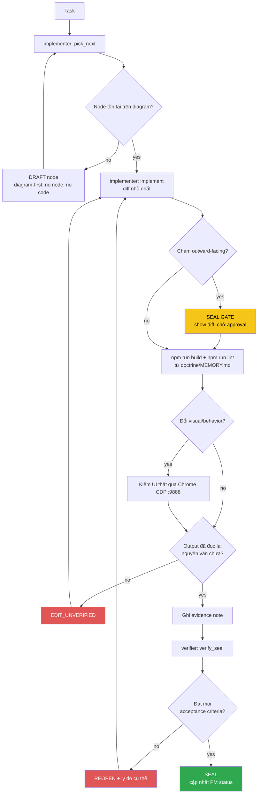

<!-- Diagram: dev-loop -->
<!-- Dev loop: plan - implement - verify - seal -->
DNA: 'smallest_diff / edit_x_read_back_proof_x_independent_verdict'
Auth: 65537 | Version: 1.0.0
Law: LAI-13 - monotonic ratchet (PENDING -> IN_PROGRESS -> SEALED, never demote)

> Mọi thay đổi tới repo code đi vào đây và đi ra bằng SEALED hoặc REOPENED —
> không có trạng thái nào khác ở giữa.

## PM status
| Node | State | Notes |
|---|---|---|
| `light-theme-elevation` | SEALED | Light mode: `--theme-canvas` → trắng thuần; `ThemeHeader`/`ThemeFooter` giữ `bg-theme-panel` (`248 250 252`); `ThemePanel` (editor) có `--theme-editor` (`226 232 240`) riêng + `shadow-md` để nổi trội hơn. Verified: `npm run build`/`npm run lint` sạch + Chrome CDP computed style. Evidence: `evidence/implementer/2026-08-16/light-theme-elevation-{plan,diff}.md`, `evidence/verifier/2026-08-16/light-theme-elevation-seal.md`. |
| `centralize-color-tokens` | SEALED | Gom nơi khai báo mã màu vào 1 chỗ dễ tìm/dễ sửa: đổi tên `themes/portfolio-dev/tokens/` → `themes/portfolio-dev/settings-colors-theme/` (giữ nguyên `dark.css`/`light.css`, giữ format RGB triplet vì `<alpha-value>` opacity modifier cần nó). Verified: build/lint sạch + grep trực tiếp trên CSS đã build. Evidence: `evidence/implementer/2026-08-16/centralize-color-tokens-{plan,diff}.md`, `evidence/verifier/2026-08-16/centralize-color-tokens-seal.md`. |
| `light-theme-code-syntax-contrast` | SEALED | Bug thật: `utils/tsCodeLines.ts` (Skills), `utils/jsonCodeLines.ts` (Educations), `themes/portfolio-dev/pages/resumeObject/Experiences.vue` (scoped style) dùng màu Tailwind literal thay vì theme token. Fix: 10 token `--theme-code-*` mới (dark = giá trị literal cũ nguyên văn, light = shade đậm hơn cùng hue). Verified: build/lint sạch + CDP computed style + screenshot 3 section. Evidence: `evidence/implementer/2026-08-16/light-theme-code-syntax-contrast-{plan,diff}.md`, `evidence/verifier/2026-08-16/light-theme-code-syntax-contrast-seal.md`. |
| `editor-dracula-scope` | SEALED | Theme riêng cho file-tree + editor (`<ThemePanel>` và mọi thứ bên trong) — KHÔNG đụng header/footer/trang ngoài. Dark = Dracula chuẩn 11 màu canonical; light = palette Dracula-light tự suy (đảo Foreground↔Background, đậm hoá accent). Bám dark/light toggle sẵn có, không thêm toggle mới. Cơ chế: `themes/portfolio-dev/settings-colors-theme/editor-dracula.css` override toàn bộ `--theme-*`/`--theme-code-*` trong class `.editor-scope` (root của `Panel.vue`) — 0 thay đổi ở Folder/NavItem/FilterFolder/CodeBlock/PostCategories. Verified: build/lint sạch + CDP computed style 2 mode + verifier tự recompute hex→rgb độc lập. Evidence: `evidence/implementer/2026-08-16/editor-dracula-scope-{plan,diff}.md`, `evidence/verifier/2026-08-16/editor-dracula-scope-seal.md`. |

Any regression phải là **node mới** (LAI-13) — không được sửa trực tiếp PM
status của node cũ để "gỡ" một SEAL đã có.
