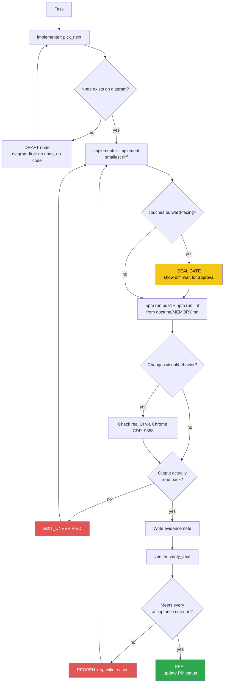

<!-- Diagram: dev-loop -->
<!-- Dev loop: plan - implement - verify - seal -->
DNA: 'smallest_diff / edit_x_read_back_proof_x_independent_verdict'
Auth: 65537 | Version: 1.0.0
Law: LAI-13 - monotonic ratchet (PENDING -> IN_PROGRESS -> SEALED, never demote)

> Every change to the repo's code enters here and leaves as SEALED or
> REOPENED — no state in between.

## PM status
| Node | State | Notes |
|---|---|---|
| `light-theme-elevation` | SEALED | Light mode: `--theme-canvas` → pure white; `ThemeHeader`/`ThemeFooter` keep `bg-theme-panel` (`248 250 252`); `ThemePanel` (editor) gets its own `--theme-editor` (`226 232 240`) + `shadow-md` to stand out more. Verified: `npm run build`/`npm run lint` clean + Chrome CDP computed style. Evidence: `evidence/implementer/2026-08-16/light-theme-elevation-{plan,diff}.md`, `evidence/verifier/2026-08-16/light-theme-elevation-seal.md`. |
| `centralize-color-tokens` | SEALED | Centralized where color codes are declared into one easy-to-find/edit place: renamed `themes/portfolio-dev/tokens/` → `themes/portfolio-dev/settings-colors-theme/` (kept `dark.css`/`light.css` as-is, kept the RGB-triplet format since the `<alpha-value>` opacity modifier needs it). Verified: build/lint clean + grepped directly on the built CSS. Evidence: `evidence/implementer/2026-08-16/centralize-color-tokens-{plan,diff}.md`, `evidence/verifier/2026-08-16/centralize-color-tokens-seal.md`. |
| `light-theme-code-syntax-contrast` | SEALED | Real bug: `utils/tsCodeLines.ts` (Skills), `utils/jsonCodeLines.ts` (Educations), `themes/portfolio-dev/pages/resumeObject/Experiences.vue` (scoped style) used literal Tailwind colors instead of theme tokens. Fix: 10 new `--theme-code-*` tokens (dark = the exact old literal values, light = a darker shade of the same hue). Verified: build/lint clean + CDP computed style + screenshots of 3 sections. Evidence: `evidence/implementer/2026-08-16/light-theme-code-syntax-contrast-{plan,diff}.md`, `evidence/verifier/2026-08-16/light-theme-code-syntax-contrast-seal.md`. |
| `editor-dracula-scope` | SEALED | A separate theme for the file-tree + editor (`<ThemePanel>` and everything inside it) — does NOT touch header/footer/the rest of the page. Dark = standard Dracula, 11 canonical colors; light = a derived Dracula-light palette (Foreground↔Background swapped, accents darkened). Rides the existing dark/light toggle, no new toggle added. Mechanism: `themes/portfolio-dev/settings-colors-theme/editor-dracula.css` overrides every `--theme-*`/`--theme-code-*` inside the `.editor-scope` class (`Panel.vue`'s root) — 0 changes to Folder/NavItem/FilterFolder/CodeBlock/PostCategories. Verified: build/lint clean + CDP computed style in both modes + the verifier independently recomputed hex→rgb. Evidence: `evidence/implementer/2026-08-16/editor-dracula-scope-{plan,diff}.md`, `evidence/verifier/2026-08-16/editor-dracula-scope-seal.md`. |

Any regression must be a **new node** (LAI-13) — never edit an old node's
PM status directly to "undo" an existing SEAL.
