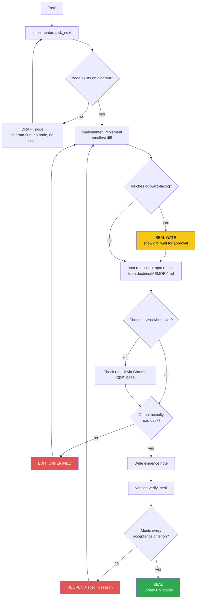

<!-- Diagram: dev-loop -->
<!-- Dev loop: plan - implement - verify - seal -->
DNA: 'smallest_diff / edit_x_read_back_proof_x_independent_verdict'
Auth: 65537 | Version: 1.0.0
Law: LAI-13 - monotonic ratchet (PENDING -> IN_PROGRESS -> SEALED, never demote)

> Every change to the repo's code enters here and leaves as SEALED or
> REOPENED — no state in between.

## PM status
> Older SEALED nodes (2026-08-16 through 2026-08-19) moved to
> `haven/diagrams/dev-loop-archive.md` to keep this file small — every
> worker session reads this file in full. Nothing deleted: the archive
> has each row's full original text verbatim. The compact rows below
> point to it; open the archive only when you need the full story
> behind an old node. `pick_next` only needs non-archived rows.

| Node | State | Notes |
|---|---|---|
| `i18n-page-content` | SEALED | Follow-up to `i18n-foundation` (issue #80): translated the static prose that's unique to each page's content (previously only site-wide chrome — header/footer/nav — was translated). New locale keys under `resume`/`projects`/`blogs`/`post`/`contact`/`github` namespaces in `i18n/locales/{vi,en}.json`, consumed via `useI18n()`'s `t()` in each `themes/portfolio-dev/pages/<dir>/*.vue` plus the 4 top-level `pages/*.vue` files' `useSeoMeta` (title/description, now `computed(() => t(...))` so they react to locale switches). Also fixed the issue's separately-flagged remaining gap: `nuxt.config.ts`'s `app.head.htmlAttrs.lang` was a static `'vi'` fallback — `app.vue` now calls `useLocaleHead()` + `useHead()` to set `<html lang>` to the real active locale. Giscus's own `data-lang` (previously hardcoded `'vi'`) now follows `locale.value`, with a live `setConfig({lang})` postMessage on locale switch, matching the existing dark/light `setConfig({theme})` pattern. Deliberately left untranslated (consistent with the `i18n-foundation` precedent that nav labels are filename-style, not prose): `resumeObject/Index.vue`'s section labels (`about-me.md`, `skills.ts`...), `contact/Index.vue`'s `_name:`/`_email:`/`_message:` field labels, its `contacts`/`find-me-also-in` sidebar section labels, and its `submit-message` button — all styled as code/file identifiers, not natural-language prose. Verified: build/lint clean (independently re-run by the verifier from a cold cache, exact `34 problems (0 errors, 34 warnings)` baseline match, confirmed `Detail.vue`'s single warning hit is pre-existing/unrelated to this diff) + CDP independently re-verified with a fresh, separately-written `puppeteer-core` script: real click-based `/` → `/en` switch (`<html lang>` `vi-VN` → `en-US`), every listed page's translated text/title in both locales, and a real `/blogs/<id>` post detail page showing the real Giscus iframe's `src` locale segment flip (`/vi/widget` ⇄ `/en/widget`) with 0 console errors throughout. Issue #80, branch `feature/80`. Evidence: `evidence/implementer/2026-08-25/i18n-page-content-{plan,diff}.md`, `evidence/verifier/2026-08-25/i18n-page-content-seal.md`. |
| `open-to-work-badge` | SEALED | Backend (`ResumeAPI`) added `generalInformation.openToWork` (Boolean, default `false`), exposed via `/api/me/{email}` at `data.generalInformation.openToWork`. Wired through `types/resume-document.ts`'s `GeneralInformation` interface → `HeroModel` (`models/Hero.ts`, new `openToWork = false` field) → `ResumeAdapter.toHero()` (`Boolean(generalInformation.openToWork)`) → `useResumeStore`'s existing `hero` getter (no change needed there). UI: a small green badge ("Open to work") added to `themes/portfolio-dev/pages/resumeObject/Hero.vue`, `v-if="hero.openToWork"` — fully absent from the DOM when `false`. Branch was `feature/84` off `main`, which at the time predated `feature/80`'s (then-unmerged) i18n work — `Hero.vue` had no `useI18n()`/`t()` yet at authoring time, so the badge text was left plain-English hardcoded; now that both branches are merged together, `Hero.vue` has `useI18n()` again (from `i18n-page-content`) but the badge text is STILL not run through `t()` — disclosed, tracked as a follow-up, not silently fixed as part of this merge (`SmallestDiff` — a conflict-resolution merge is not the place to opportunistically add a new translation key). Verified: build/lint clean (independently re-run by verifier, cold cache, exact `✖ 34 problems (0 errors, 34 warnings)` baseline match) + CDP independently re-verified with a fresh, separately-written `puppeteer-core` script against a fresh mock API server + separate preview ports — badge confirmed in the real DOM (`getComputedStyle` color `rgb(74, 222, 128)` = Tailwind's `text-green-400`) only when `openToWork: true` (mocked), fully absent when `false`/absent (real production data), 0 console errors either way. Issue #84, branch `feature/84`. Evidence: `evidence/implementer/2026-08-29/open-to-work-badge-{plan,diff}.md`, `evidence/verifier/2026-08-29/open-to-work-badge-seal.md`. |
| `open-to-work-badge-i18n` | SEALED | Follow-up to `open-to-work-badge` (issue #86): the badge's "Open to work" text was still hardcoded English even after `Hero.vue` regained `useI18n()`/`t()` (from the merged `i18n-page-content`). New `resume.openToWork` key added to `i18n/locales/{vi,en}.json` ("Đang tìm việc" / "Open to work"), badge template swapped to `{{ t('resume.openToWork') }}`. Verified: build/lint clean (independently re-run by verifier, cold cache, exact `✖ 34 problems (0 errors, 34 warnings)` baseline match) + CDP independently re-verified with a fresh, separately-written `puppeteer-core` script against a fresh mock API server + separate preview ports — badge shows the correct translated text on both `/` (`vi`) and `/en`, `<html lang>` correctly `vi-VN`/`en-US`, 0 console errors either way. Issue #86, branch `feature/86`. Evidence: `evidence/implementer/2026-08-29/open-to-work-badge-i18n-{plan,diff}.md`, `evidence/verifier/2026-08-29/open-to-work-badge-i18n-seal.md`. |
| `blog-posts-shape-fix` | SEALED | Fixed at the source (issue #87): `server/utils/cacheGetPost.ts`'s `cacheGetPosts` was typed as returning `Post[]` but the real blog API (`https://blog-api-nodejs-express.onrender.com/api/v1/post/`) wraps it as `{data: Post[], total, page, perPage}` — 3 call sites had grown defensive workarounds instead of fixing the type: `themes/portfolio-dev/pages/blogs/Index.vue` (a duplicated local `GetPosts` interface + `?.data?.data` unwrap), `server/routes/rss.xml.ts` and `server/routes/sitemap.xml.ts` (`Array.isArray(...) ? ... : (...).data` guards, added in issue #73). Fix: new shared `PaginatedPosts` interface in `types/blog.ts`; `cacheGetPosts` now correctly typed `Promise<PaginatedPosts>`, returns a proper empty `PaginatedPosts` shape (not `[]`) on failure; `server/api/blogs/posts.ts` passes the correctly-typed result through unchanged (external `/api/blogs/posts` response shape is byte-for-byte identical to before — no client-facing break); `rss.xml.ts`/`sitemap.xml.ts` now destructure `{ data: posts }` directly, no more defensive unwrap; `blogs/Index.vue`'s local `GetPosts` interface replaced with the shared `PaginatedPosts` import. Bonus: removing the now-correctly-typed destructure in `cacheGetPost.ts` also dropped 2 pre-existing `no-unused-vars` warnings (`errors`, `message` were destructured but never used) — lint baseline moves from 34→32 problems, still 0 errors. Verified: build/lint clean (32 problems, 0 errors, down from 34 — the 2 dropped warnings are exactly the ones in the touched file) + real `curl` against a `node .output/server/index.mjs` preview showing `/api/blogs/posts` unchanged double-nested shape, `/rss.xml`/`/sitemap.xml` still producing real post entries (post count matches the API's real `total`) + CDP on `/blogs` (posts render, 0 console errors). All 3 checks independently reproduced by the verifier from a cold cache with a fresh preview port/CDP script. Issue #87, branch `feature/87`. Evidence: `evidence/implementer/2026-08-29/blog-posts-shape-fix-{plan,diff}.md`, `evidence/verifier/2026-08-29/blog-posts-shape-fix-seal.md`. |
| `readme-refresh` | SEALED | Docs-only fix (issue #90): `README.md` was stale against the real shipped feature set. Added: the 3 missing `GISCUS_*` env vars to the Environment Variables table (present in `.env.example` but not README) + a note that they're optional (placeholder renders until set); a new "Feeds" section documenting `/rss.xml`/`/sitemap.xml` (shipped in #73); a note on `/blogs/[id]` now having Giscus comments; a bilingual-routing note (`vi` unprefixed default, `/en/*` for English, from #75/#80) both in the Pages section and as a new Tech Stack bullet (`@nuxtjs/i18n`). No code touched. Verified: build/lint clean (32 problems, 0 errors, unchanged from the `blog-posts-shape-fix` baseline — independently re-run by the verifier from a cold cache, exact match) + verifier independently cross-checked every factual claim against the real code (`.env.example`'s 3 `GISCUS_*` keys, `rss.xml.ts`'s real `perPage: 20`, `sitemap.xml.ts`'s real `STATIC_ROUTES`) — all accurate, no drift. No CDP needed — no runtime/visual behavior changed. Issue #90, branch `feature/90`. Evidence: `evidence/implementer/2026-08-29/readme-refresh-{plan,diff}.md`, `evidence/verifier/2026-08-29/readme-refresh-seal.md`. |
| `centralize-color-tokens` | SEALED | 2026-08-16 — archived, see `haven/diagrams/dev-loop-archive.md`. Evidence: `evidence/implementer/2026-08-16/centralize-color-tokens-{plan,diff}.md`. |
| `editor-dracula-scope` | SEALED | 2026-08-16 — archived, see `haven/diagrams/dev-loop-archive.md`. Evidence: `evidence/implementer/2026-08-16/editor-dracula-scope-{plan,diff}.md`. |
| `light-theme-code-syntax-contrast` | SEALED | 2026-08-16 — archived, see `haven/diagrams/dev-loop-archive.md`. Evidence: `evidence/implementer/2026-08-16/light-theme-code-syntax-contrast-{plan,diff}.md`. |
| `light-theme-elevation` | SEALED | 2026-08-16 — archived, see `haven/diagrams/dev-loop-archive.md`. Evidence: `evidence/implementer/2026-08-16/light-theme-elevation-{plan,diff}.md`. |
| `resume-adapter-class` | SEALED | 2026-08-16 — archived, see `haven/diagrams/dev-loop-archive.md`. Evidence: `evidence/implementer/2026-08-16/resume-adapter-class-{plan,diff}.md`. |
| `resume-data-models` | SEALED | 2026-08-16 — archived, see `haven/diagrams/dev-loop-archive.md`. Evidence: `evidence/implementer/2026-08-16/resume-data-models-{plan,diff}.md`. |
| `giscus-comment` | SEALED | 2026-08-19 — archived, see `haven/diagrams/dev-loop-archive.md`. Evidence: `evidence/implementer/2026-08-19/giscus-comment-{plan,diff}.md`. |
| `giscus-live-fix` | SEALED | 2026-08-19 — archived, see `haven/diagrams/dev-loop-archive.md`. Evidence: `evidence/implementer/2026-08-19/giscus-live-fix-{plan,diff}.md`. |
| `i18n-foundation` | SEALED | 2026-08-19 — archived, see `haven/diagrams/dev-loop-archive.md`. Evidence: `evidence/implementer/2026-08-19/i18n-foundation-{plan,diff}.md`. |
| `rss-sitemap-feed` | SEALED | 2026-08-19 — archived, see `haven/diagrams/dev-loop-archive.md`. Evidence: `evidence/implementer/2026-08-19/rss-sitemap-feed-{plan,diff}.md`. |

Any regression must be a **new node** (LAI-13) — never edit an old node's
PM status directly to "undo" an existing SEAL.
