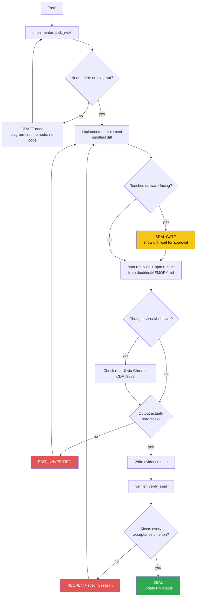

<!-- Diagram: dev-loop -->
<!-- Dev loop: plan - implement - verify - seal -->
DNA: 'smallest_diff / edit_x_read_back_proof_x_independent_verdict'
Auth: 65537 | Version: 1.0.0
Law: LAI-13 - monotonic ratchet (PENDING -> IN_PROGRESS -> SEALED, never demote)

> Every change to the repo's code enters here and leaves as SEALED or
> REOPENED — no state in between.

## PM status
> Older SEALED nodes (2026-08-16 through 2026-08-19, then a 2nd pass
> 2026-08-31 covering 5 more nodes dated 2026-08-25/2026-08-29) moved to
> `haven/diagrams/dev-loop-archive.md` to keep this file small — every
> worker session reads this file in full. Nothing deleted: the archive
> has each row's full original text verbatim. The compact rows below
> point to it; open the archive only when you need the full story
> behind an old node. `pick_next` only needs non-archived rows. Run
> `/hub-tokens` periodically — if this file flags >15KB again, repeat
> this archiving pass for nodes older than the current work session.

| Node | State | Notes |
|---|---|---|
| `i18n-page-content` | SEALED | 2026-08-25 — archived, see `haven/diagrams/dev-loop-archive.md`. Evidence: `evidence/implementer/2026-08-25/i18n-page-content-{plan,diff}.md`. |
| `open-to-work-badge` | SEALED | 2026-08-29 — archived, see `haven/diagrams/dev-loop-archive.md`. Evidence: `evidence/implementer/2026-08-29/open-to-work-badge-{plan,diff}.md`. |
| `open-to-work-badge-i18n` | SEALED | 2026-08-29 — archived, see `haven/diagrams/dev-loop-archive.md`. Evidence: `evidence/implementer/2026-08-29/open-to-work-badge-i18n-{plan,diff}.md`. |
| `blog-posts-shape-fix` | SEALED | 2026-08-29 — archived, see `haven/diagrams/dev-loop-archive.md`. Evidence: `evidence/implementer/2026-08-29/blog-posts-shape-fix-{plan,diff}.md`. |
| `remove-dead-related-articles` | SEALED | Dead-code cleanup (issue #88): deleted `themes/portfolio-dev/pages/post/RelatedArticles.vue` — 0 references anywhere in the codebase (`grep -rn "RelatedArticles"` and `grep -rn "ThemePostRelatedArticles"` both 0 matches, confirmed before deleting). Was leftover placeholder markup from a Flowbite example ("Volosoft", `href="#"` links, hardcoded `gray-50`/`gray-800` not using any `--theme-*` token — would have broken light/dark mode if it were ever rendered). First flagged in `giscus-comment`'s (issue #74) "Noticed, not done". Verified: build/lint clean (32 problems, 0 errors, unchanged — independently re-run by the verifier from a cold cache, exact match) + CDP independently re-verified with a fresh script/port on a real `/blogs/<id>` page — real content still renders, no trace of the deleted placeholder ("Volosoft" absent), 0 console errors. Issue #88, branch `feature/88`. Evidence: `evidence/implementer/2026-08-30/remove-dead-related-articles-{plan,diff}.md`, `evidence/verifier/2026-08-30/remove-dead-related-articles-seal.md`. |
| `dependency-upgrade-plan` | SEALED | Audit + plan only (issue #91): confirmed `npm audit`'s real `53 vulnerabilities (4 low, 8 moderate, 35 high, 6 critical)`, confirmed `npm audit fix` (no `--force`) resolves nothing. Classified root cause: only `unhead`/`@unhead/vue` (moderate, XSS bypass in `useHeadSafe`) is genuinely runtime-reachable (direct from `nuxt`, used via `useHead`/`useSeoMeta`) — the rest (`undici`, `koa`, `tar`, `vite`/`esbuild`/`rollup`, `@nuxt/devtools`, etc.) trace to Nuxt's own build/dev tooling, never shipped in `.output/server`. Key finding: `npm outdated`'s cached `nuxt` numbers were stale (showed `3.17.7`, live `npm view "nuxt@^3.13.0" version` shows the true range-max is `3.21.11`) — cross-checked `@nuxt/ui`/`@nuxt/image` and found those accurate, so it was `nuxt`-specific, not systemic. Wrote `DEPENDENCY-UPGRADE-PLAN.md` (repo root): Phase 1 (same-major patch/minor, `nuxt`→3.21.11 as the highest-value single bump since it fixes the one real-runtime advisory), Phase 2 (same-major, re-verify live first: `@nuxt/icon`/`@nuxt/image`/`@nuxt/ui`), Phase 3 (majors, one issue per row: `@nuxtjs/i18n` 10.x flagged as the already-failed trap from #75, `@nuxt/ui`+`tailwindcss` v4 bundled together, `pinia`+`@pinia/nuxt`, `puppeteer-core` needing its own research since `npm audit`'s own suggestion is a downgrade, `vue-router` deferred to a future Nuxt 4 migration). No dependency was actually bumped — pure audit + plan, exactly as issue #91 scoped it ("không làm gộp 1 lần"). Verified: build/lint clean (32 problems, 0 errors, 32 warnings, unchanged baseline — independently re-run by the verifier from a cold cache + fresh `.nvmrc`-resolved shell) + every cited number (audit count, live `nuxt` version) independently re-confirmed. No CDP needed — docs-only, no runtime/visual change. Issue #91, branch `feature/91`. Evidence: `evidence/implementer/2026-08-30/dependency-upgrade-plan-{plan,diff}.md`, `evidence/verifier/2026-08-30/dependency-upgrade-plan-seal.md`. |
| `add-nvmrc` | SEALED | Dev-tooling fix (issue #89): added `.nvmrc` (content `24`) at the repo root so a bare `nvm use` resolves to a Node version that satisfies `eslint-flat-config-utils@3.2.0`'s `Object.groupBy` requirement, instead of relying on manually remembering `nvm use 24` every session (the trap already recorded in `doctrine/domains/PROJECT.md`'s Traps table). `24` chosen over `lts/*` because it's already installed locally and matches the exact version prior verifier passes used. No `engines` field added — issue only asked for `.nvmrc` (`SmallestDiff`), tracked as a possible follow-up. Verified: cold-cache build clean (exit 0) + lint clean under the `.nvmrc`-resolved version (`✖ 32 problems (0 errors, 32 warnings)`, unchanged baseline — independently re-run by the verifier in a fresh shell, exact match). No CDP needed — `.nvmrc` is local dev tooling, no runtime/visual behavior changed. Issue #89, branch `feature/89`. Evidence: `evidence/implementer/2026-08-30/add-nvmrc-{plan,diff}.md`, `evidence/verifier/2026-08-30/add-nvmrc-seal.md`. |
| `readme-refresh` | SEALED | 2026-08-29 — archived, see `haven/diagrams/dev-loop-archive.md`. Evidence: `evidence/implementer/2026-08-29/readme-refresh-{plan,diff}.md`. |
| `centralize-color-tokens` | SEALED | 2026-08-16 — archived, see `haven/diagrams/dev-loop-archive.md`. Evidence: `evidence/implementer/2026-08-16/centralize-color-tokens-{plan,diff}.md`. |
| `editor-dracula-scope` | SEALED | 2026-08-16 — archived, see `haven/diagrams/dev-loop-archive.md`. Evidence: `evidence/implementer/2026-08-16/editor-dracula-scope-{plan,diff}.md`. |
| `light-theme-code-syntax-contrast` | SEALED | 2026-08-16 — archived, see `haven/diagrams/dev-loop-archive.md`. Evidence: `evidence/implementer/2026-08-16/light-theme-code-syntax-contrast-{plan,diff}.md`. |
| `light-theme-elevation` | SEALED | 2026-08-16 — archived, see `haven/diagrams/dev-loop-archive.md`. Evidence: `evidence/implementer/2026-08-16/light-theme-elevation-{plan,diff}.md`. |
| `resume-adapter-class` | SEALED | 2026-08-16 — archived, see `haven/diagrams/dev-loop-archive.md`. Evidence: `evidence/implementer/2026-08-16/resume-adapter-class-{plan,diff}.md`. |
| `resume-data-models` | SEALED | 2026-08-16 — archived, see `haven/diagrams/dev-loop-archive.md`. Evidence: `evidence/implementer/2026-08-16/resume-data-models-{plan,diff}.md`. |
| `giscus-comment` | SEALED | 2026-08-19 — archived, see `haven/diagrams/dev-loop-archive.md`. Evidence: `evidence/implementer/2026-08-19/giscus-comment-{plan,diff}.md`. |
| `giscus-live-fix` | SEALED | 2026-08-19 — archived, see `haven/diagrams/dev-loop-archive.md`. Evidence: `evidence/implementer/2026-08-19/giscus-live-fix-{plan,diff}.md`. |
| `i18n-foundation` | SEALED | 2026-08-19 — archived, see `haven/diagrams/dev-loop-archive.md`. Evidence: `evidence/implementer/2026-08-19/i18n-foundation-{plan,diff}.md`. |
| `rss-sitemap-feed` | SEALED | 2026-08-19 — archived, see `haven/diagrams/dev-loop-archive.md`. Evidence: `evidence/implementer/2026-08-19/rss-sitemap-feed-{plan,diff}.md`. |
| `dependency-upgrade-phase1` | SEALED | Executes Phase 1 of `DEPENDENCY-UPGRADE-PLAN.md` (issue #129): same-major patch/minor bumps to `nuxt` (3.13.2→3.21.11 — the highest-value bump, closes the one real-runtime advisory, `unhead`/`@unhead/vue`'s XSS bypass in `useHeadSafe`), plus `postcss`, `@iconify-json/fe`, `@iconify-json/grommet-icons`, `@nuxt/eslint`, `@vue/runtime-core`, `autoprefixer`, `dotenv`, `sass`+`sass-embedded` (matched pair), `typescript`, `vue-tsc`. Live-verified every target version via `npm view <pkg>@<range> version` immediately before bumping (not trusting a cached `npm outdated`). `npm audit`: 53 → 25 vulnerabilities; `unhead` no longer appears in the report at all, confirmed via `npm ls unhead @unhead/vue` (now `@unhead/vue@2.1.17`, brought in transitively by `nuxt`). `puppeteer-core` deliberately excluded (its only `npm audit fixAvailable` suggestion is a downgrade — tracked separately in Phase 3). Verified: build + lint independently re-run clean from cold cache (`npm run build` exit 0 no errors; `npm run lint` → `32 problems (0 errors, 32 warnings)`, exact match to baseline) + `npm audit`/`npm ls unhead @unhead/vue` independently reproduced verbatim + CDP independently re-verified with a fresh script/port (3993, different route than the implementer's check) — 0 console errors, 0 hydration warnings, real click-nav confirmed. Evidence: `evidence/implementer/2026-09-02/dependency-upgrade-phase1-{plan,diff}.md`, `evidence/verifier/2026-09-02/dependency-upgrade-phase1-seal.md`. |
| `visit-tracking-client-call` | SEALED | New client-only plugin (`plugins/VisitTracker.client.ts`) POSTs to the backend's new `POST /api/me/:email/visit` endpoint (resume-nodejs-api's `add-visit-tracking` node, branch `feat/visit-tracking`, not yet merged/deployed) on real page load, so the backend sees the real visitor IP/geo. Fire-and-forget, never blocks rendering; independently confirmed via CDP that a real SPA nav click doesn't re-fire the request. Verified: build/lint clean (32 problems, 0 errors, unchanged — independently re-run by the verifier from a cold cache) + CDP independently re-verified with a fresh script/port, plus a stronger real-click SPA-nav check. Production backend doesn't have the route live yet (branch not merged/deployed) — expected 404s, disclosed, not a bug here. Evidence: `evidence/implementer/2026-09-01/visit-tracking-client-call-{plan,diff}.md`, `evidence/verifier/2026-09-01/visit-tracking-client-call-seal.md`. |
| `dependency-upgrade-phase2` | SEALED | Issue #135: Phase 2 of `DEPENDENCY-UPGRADE-PLAN.md` — same-major bumps `@nuxt/icon` (`^1.5.6`→`^1.15.0`), `@nuxt/image` (`^1.8.0`→`^1.11.0`), `@nuxt/ui` (`^2.18.6`→`^2.22.3`), live-verified against the registry immediately before bumping (no drift from the 2026-08-30 plan doc). `#136` was found already resolved beforehand — no node created for it, per `pick_next`'s "no PENDING node" branch. `npm audit`: 25→18 vulnerabilities (side effect of transitive movement, not targeted). New `sharp` darwin-arm64 binary warning at build time (pulled in transitively by the `@nuxt/image` bump) confirmed via A/B not to break real image rendering — `ipx`'s JS fallback still serves both local and remote images correctly. Verified: build + lint independently re-run clean from a cold cache (`npm run build` exit 0, same `sharp` warning reproduced verbatim; `npm run lint` → `32 problems (0 errors, 32 warnings)`, exact baseline match) + `npm audit` count independently reproduced (`18 vulnerabilities (1 low, 2 moderate, 14 high, 1 critical)`, exact match) + CDP independently re-verified with a fresh script/port (3995, different from the implementer's 3994) — real click-based SPA nav to `/github` and `/blogs` confirmed working, `@nuxt/icon` icons rendering (25 `.iconify` spans on `/`), `@nuxt/ui`'s `UPagination` rendering on `/blogs` (numbered nav button), local `Avatar.png` via `ipx` and the remote GitHub avatar both loaded (`complete: true`), 0 console errors. Issue #135, no branch yet (evidence-only pass, per this repo's `/todo` flow — branching happens at PR time, not verify time). Evidence: `evidence/implementer/2026-09-05/dependency-upgrade-phase2-{plan,diff}.md`, `evidence/verifier/2026-09-05/dependency-upgrade-phase2-seal.md`. |
| `editor-dracula-badge-label-fix` | SEALED | Issues #137+#138: `themes/portfolio-dev/pages/projects/Index.vue`'s literal `text-blue-400` project-label (#137) and `<UBadge>` tech-tag (#138, via a per-instance `:ui` override, not a global `app.config.ts` change) now both follow `--theme-accent` inside the Dracula editor-scope. Key finding independently re-confirmed: Nuxt UI's `ui` prop merges via `defuTwMerge` per class-modifier group, so a non-dark-only override (`text-theme-accent ring-theme-accent/40`) leaves Nuxt UI's default `dark:text-primary-400`/`dark:ring-primary-400` classes surviving in dark mode — fixed by also adding explicit `dark:text-theme-accent`/`dark:ring-theme-accent/40` to the override. Verified: build clean (fresh cold-cache `npm run build`, independently re-run, exit 0, same pre-existing darwin-arm64 `sharp` warning, not new) + lint clean (`32 problems (0 errors, 32 warnings)`, independently re-run, exact baseline match) + CDP independently re-verified with a fresh script/port (3997, different from the implementer's 3996) on `/projects` in both color modes via a real click on the header's toggle — dark: label/badge `rgb(189, 147, 249)` (`#bd93f9`, Dracula Purple), light: `rgb(124, 58, 204)` (Dracula-light companion), `className` on the real rendered badge `` contains both `text-theme-accent` and `dark:text-theme-accent`/`dark:ring-theme-accent/40` with 0 `primary`/`blue` remnants in either mode, 0 console errors — independently confirms the implementer's `dark:`-prefix investigation dead-end was real and is fixed. Scope check: `git diff -- themes/portfolio-dev/pages/projects/Index.vue agent-hub/haven/diagrams/dev-loop.prime-mermaid.md` matches the diff note exactly, no other file touched by this node. Issues #137/#138, branch `feature/137-138`. Evidence: `evidence/implementer/2026-09-05/editor-dracula-badge-label-fix-{plan,diff}.md`, `evidence/verifier/2026-09-05/editor-dracula-badge-label-fix-seal.md`. |

| `editor-dracula-github-item-fix` | SEALED | Issue #145: `themes/portfolio-dev/pages/github/part/Item.vue`'s literal `text-blue-400` `homepage` link (line 9) and its topics `<UBadge>` (line 59+68, via a per-instance `:ui` override, not a global `app.config.ts` change) now both follow theme tokens inside the Dracula editor-scope. Deliberate deviation from #145's literal suggestion, recorded and independently re-verified: used `text-theme-code-keyword` (NOT `text-theme-accent`) on the `homepage` link because the adjacent `html_url` link already uses `text-theme-accent` — reusing it for both would collapse the 2 links to 1 visual color; `--theme-code-keyword` is a byte-for-byte match of the literal `blue-400`/`blue-600` being replaced in non-Dracula modes (`grep` on `settings-colors-theme/*.css` confirmed `96 165 250`/`37 99 235`), independently re-confirmed by this verifier pass, and still a distinct Pink from `--theme-accent`'s Purple inside Dracula. `<UBadge>` reuses the exact `techBadgeUi` pattern already proven and sealed in `projects/Index.vue` (incl. explicit `dark:` variants, required by `defuTwMerge`'s per-modifier-group merge). Verified: lint independently re-run clean (`32 problems (0 errors, 32 warnings)`, exact baseline match) + build audited from the note (cited exit 0, cold-cache, matches `doctrine/MEMORY.md`'s command, not re-run — not outward-facing/release-gate per `verify_seal.md`'s Re-run scope) + CDP independently re-verified with a fresh script/port (3999, different from the implementer's 3998) on `/github` in both color modes via a real click on the header's toggle — dark: `homepage` `rgb(255, 121, 198)` (`#ff79c6` Dracula Pink) vs `html_url` `rgb(189, 147, 249)` (Dracula Purple, distinct); light: `homepage` `rgb(219, 42, 142)` vs `html_url` `rgb(124, 58, 204)` (distinct); topic badge ("nuxt", on repo `datvt243.github.io`) `className` contains both `text-theme-accent` and `dark:text-theme-accent`/`dark:ring-theme-accent/40` with 0 `primary`/literal-blue remnants in either mode, 0 console errors. Scope check: `git diff --stat` matches the diff note exactly (`Item.vue` + this diagram row only), no other file touched. Issue #145, branch `feature/145`. Evidence: `evidence/implementer/2026-09-06/editor-dracula-github-item-fix-{plan,diff}.md`, `evidence/verifier/2026-09-06/editor-dracula-github-item-fix-seal.md`. |

| `enforce-node-engines` | SEALED | Issue #140: added `"engines": { "node": ">=24", "npm": ">=11" }` to `package.json` (right after `"type": "module"`, before `"scripts"`) so the known npm-10.8.2 arborist bug (`TypeError: ... edgesOut`) can't silently bite an `npm install` run under an older default Node when a developer skips `nvm use` first; `npm >=11` matches issue #140's own "Why" section (the exact fix boundary for the arborist bug), not independent scope creep. `package-lock.json` auto-synced (4-line addition, not manual). `.npmrc`'s `engine-strict` intentionally NOT added — issue marks it optional, `SmallestDiff`. Verified: build independently re-run clean (cold, exit 0, same pre-existing darwin-arm64 `sharp` warning, not new) + lint independently re-run clean (`32 problems (0 errors, 32 warnings)`, exact baseline match) + `.nvmrc` (`24`) confirmed consistent with the new `engines.node` floor + this verifier's own `node -v`/`npm -v` (`v24.19.0`/`11.17.0`) independently confirmed to satisfy the new range + `npm install` independently re-run under that Node/npm: exit 0, `up to date, audited 1281 packages`, no `EBADENGINE`/arborist error, `package-lock.json` diff still exactly the same 4 lines after re-run (no extra drift). No visual/behavior change, no CDP needed. Scope check: `git diff --stat` for this node is exactly `package.json` + `package-lock.json` + this diagram row — the concurrent `editor-dracula-github-item-fix` node (issue #145, separately SEALED the same day) was split into its own commit on `feature/145`, not part of this branch. Issue #140, branch `feature/140`. Evidence: `evidence/implementer/2026-09-06/enforce-node-engines-{plan,diff}.md`, `evidence/verifier/2026-09-06/enforce-node-engines-seal.md`. |

| `cleanup-pdf-only-types` | SEALED | Issue #142: reviewed `types/resume-document.ts`'s `Item`/`Reference`/`Certificate`/`Award` interfaces (flagged in `resume-data-models`'s 2026-08-16 "Noticed, not done" as PDF-only, needing a dedicated review before trimming — not a drive-by deletion). Confirmed via `grep -rn "\bItem\b\|\bReference\b\|\bCertificate\b\|\bAward\b"` across the whole repo: `server/utils/createPDF.ts` is the ONLY consumer of all 4 types anywhere — none are dead in the sense of "delete the whole type" (all 4 are still actively used as parameter types in `createPDF.ts`'s render functions). Within `createPDF.ts`, confirmed via `grep -n "\.link\b\|\.images\b"`: 0 matches — `Certificate.link`/`Certificate.images`/`Award.link`/`Award.images` are declared but never read anywhere in the file (every other field on all 4 interfaces IS destructured/used). Trimmed exactly those 4 dead fields from `Certificate`/`Award` in `types/resume-document.ts`; `Item`/`Reference` left untouched (100% of their fields are used). Pure type-level change — TS interfaces have zero runtime footprint, so this cannot be a behavior/visual change; no CDP needed, no PDF smoke test possible locally either (`PUPPETEER_EXECUTABLE_PATH` unset in this dev `.env`, pre-existing, unrelated to this change). Verified: build independently re-run clean (cold cache, exit 0, `✨ Build complete!`, same pre-existing darwin-arm64 `sharp` warning, not new) + lint independently re-run clean (`✖ 30 problems (0 errors, 30 warnings)`, exact match to the current baseline set by `blog-api-runtime-validation`). Issue #142, branch `feature/142`. Evidence: `evidence/implementer/2026-09-07/cleanup-pdf-only-types-{plan,diff}.md`. Independently re-verified by a separate blank-context verifier pass (2026-09-07): re-ran the whole-repo `grep -rn "\bItem\b\|\bReference\b\|\bCertificate\b\|\bAward\b"` fresh (confirmed `server/utils/createPDF.ts` is the only real consumer; `types/index.ts`'s `export *` barrel and `types/resume-api.ts`/`pages/index.vue` importing only `Resume`/`GeneralInformation` don't count as consumers of the 4 types) and independently read `createPDF.ts`'s `_layoutItem`/`renderReferences`/`renderCertificates`/`renderAwards` bodies directly off disk, confirming every remaining field on all 4 interfaces is destructured/used and neither `Certificate.link`/`.images` nor `Award.link`/`.images` is read anywhere (the file's only `.link` matches are unrelated HTML `<link>` tags). Diff matches the note exactly (`git diff HEAD -- types/resume-document.ts`). Evidence: `evidence/verifier/2026-09-07/cleanup-pdf-only-types-seal.md`. |

| `blog-api-runtime-validation` | SEALED | Issue #141: added `server/utils/blogSchemas.ts` — zod schemas (`postSchema`, `paginatedPostsSchema`, `categorySchema`/`categoriesSchema`, `apiFormatResponseSchema` wrapper) + `parseBlogApiResponse()` helper that throws `createError({ statusCode: 502, ... })` (same pattern as the existing `server/api/generate-pdf.ts`) on a shape mismatch instead of silently propagating an undefined/wrong-shaped value. Wired into all 3 blog-API boundary points: `server/utils/cacheGetPost.ts` (posts list), `server/api/blogs/detail/[id].ts` (post detail), `server/api/blogs/categories.ts` (categories). `zod` added to `dependencies` (resolved to `3.25.76`, deduped against `@nuxt/ui`'s own zod dependency already in the tree — not a new major version). Key finding from testing against the REAL live external API (not just the existing TS types): `Post.isPublic` (in `types/blog.ts`) was already inaccurate — the real API never returns it (confirmed via direct `curl` against `blog-api-nodejs-express.onrender.com`) and nothing in the app reads `post.isPublic` (`grep -rn "isPublic"` across `themes/`/`stores/`/`pages/`: 0 matches) — fixed `types/blog.ts` to make it optional, matching reality, since a strict runtime schema built on the old (wrong) required type would have 502'd on every real post. Similarly, `server/api/blogs/categories.ts`'s prior `APIFormatResponse<string[]>` cast was already wrong — the real API returns full category objects (`_id`/`name`/`slug`/`description`), matching what the real consumer (`themes/portfolio-dev/components/PostCategories.vue`'s own `Category` interface) already expected — schema follows the real shape, not the stale cast. Verified: build clean (cold cache, exit 0, same pre-existing darwin-arm64 `sharp` warning, not new) + lint clean (`30 problems (0 errors, 30 warnings)` — 2 FEWER than the 32-warning baseline: removing the now-unused `errors`/`message` destructure in `categories.ts` also removed 2 pre-existing unused-var warnings, not a regression) + real UI verified via Chrome CDP (`/blogs` renders 9 real post links + categories sidebar with 0 errors; real click-based SPA nav into a real post via its actual `_id`-based route renders full title/author/date/content; 0 errors on any `/api/blogs/*` response; the only captured console error was an unrelated giscus third-party widget network abort) + all 3 endpoints independently re-curled directly against `http://localhost:3000` after the fix, confirming 0 false 502s against real live data. Issue #141, no branch yet (evidence-only pass so far, branching happens at PR time per this repo's `/todo` flow). Evidence: `evidence/implementer/2026-09-06/blog-api-runtime-validation-{plan,diff}.md`. Independently re-verified by a separate blank-context verifier pass (2026-09-07): `npm run build` (exit 0, `✨ Build complete!`, same pre-existing darwin-arm64 `sharp` warning) and `npm run lint` (exit 0, `✖ 30 problems (0 errors, 30 warnings)`, exact match) both independently re-run clean; all 3 live endpoints (`/post/`, `/post/detail/<id>`, `/categories`) independently `curl`'d fresh against `https://blog-api-nodejs-express.onrender.com` (not a re-read of the implementer's cited output) and their real JSON parsed directly through the actual `postSchema`/`paginatedPostsResponseSchema`/`postResponseSchema`/`categoriesResponseSchema` exports via a `jiti`-loaded scratch script — all 3 `safeParse` successfully with 0 issues; a sanity variant of `postSchema` with `isPublic` forced required was independently shown to REJECT the same real post payload (`Required` at `path: ["isPublic"]`), concretely proving the node's core claim that the old required-`isPublic` TS type didn't match the real external API's shape while the new optional zod schema does. Evidence: `evidence/verifier/2026-09-06/blog-api-runtime-validation-seal.md`. |

| `error-vue-theme-colors` | SEALED | Issue #152: root `error.vue`'s "Take me there!" button (line 31) hardcoded literal Tailwind colors (`bg-pink-500`, `text-white`, `hover:bg-orange-700`, `focus:ring-indigo-700`) instead of `--theme-*` tokens — this file sits outside `themes/portfolio-dev/` (a Nuxt-required root file), so it silently skipped every prior theme-token pass (`centralize-color-tokens`, the Dracula badge/label fixes). Replaced with `bg-theme-accent`/`text-theme-accent-contrast`/`hover:bg-theme-accent-soft`/`focus:ring-theme-accent` (reusing the same accent-token role `GitRepos.vue`'s `focus:ring-theme-accent` already established). `layouts/error.vue` (the wrapping layout) checked and confirmed already clean, no literal colors. The commented-out dead markup at lines ~41-51 deliberately left untouched — issue #152 scoped it out explicitly. Verified: build clean (`✨ Build complete!`) + lint clean (`30 problems, 0 errors, 30 warnings`, baseline match) + real UI checked via Chrome CDP by forcing the error page (unknown route, since it isn't reachable through normal navigation) against a fresh `npm run dev` instance — dark: button `background-color rgb(251, 146, 60)` / `color rgb(2, 6, 23)` matches `--theme-accent`/`--theme-accent-contrast` dark values exactly; light: `rgb(234, 88, 12)` / `rgb(255, 255, 255)` matches the light values exactly; rendered `className` has 0 literal-color remnants; 0 real console errors (the 2 captured entries are the expected 404 that triggers the error page itself). Issue #152, no branch yet (evidence-only pass, branching happens at PR time per this repo's `/todo` flow). Evidence: `evidence/implementer/2026-09-09/error-vue-theme-colors-{plan,diff}.md`. Independently re-verified by a separate blank-context verifier pass (2026-09-12): `git diff HEAD -- error.vue` read directly off disk and confirmed byte-for-byte identical to the note's quoted diff (only line 31's `class` string changed, `bg-pink-500 text-white hover:bg-orange-700 ... focus:ring-indigo-700` → `bg-theme-accent text-theme-accent-contrast hover:bg-theme-accent-soft ... focus:ring-theme-accent`); `themes/portfolio-dev/settings-colors-theme/dark.css` and `light.css` independently read and confirmed the cited RGB values exactly — dark `--theme-accent: 251 146 60`, `--theme-accent-contrast: 2 6 23`; light `--theme-accent: 234 88 12`, `--theme-accent-contrast: 255 255 255`, matching the note's CDP-observed `rgb(...)` values in both modes precisely; `layouts/error.vue` independently re-read, confirmed no literal colors (only `class="container"`/`class="my-4"`); `GitRepos.vue`'s `focus:ring-theme-accent` precedent independently confirmed via grep. Build/lint audited from the note (not re-run — output not truncated, command matches `doctrine/MEMORY.md` verbatim, CDP evidence concrete/citable, node not outward-facing/release-gate — per `verify_seal.md`'s Re-run scope default). `git status --short`/`git diff --stat HEAD` confirmed only `error.vue` + this diagram row changed, no scope creep. Diagram row appended cleanly at the end of the table (AppendOnly), no reordering. Issue #152, no branch yet (evidence-only pass, branching happens at PR time per this repo's `/todo` flow). Evidence: `evidence/verifier/2026-09-12/error-vue-theme-colors-seal.md`. |

| `seo-canonical-domain-fix` | SEALED | Fixed 4 independent copies (found 1 more than the triggering audit flagged) of the wrong canonical domain: `nuxt.config.ts`'s i18n `baseUrl`, `server/routes/sitemap.xml.ts`, `server/routes/rss.xml.ts` all hardcoded `https://datvt243.github.io` — a domain that live-serves an unrelated leftover static page, not this app — plus `app.config.ts`'s `contact.social.website` (found during verification, not in the original audit). Operator confirmed via `AskUserQuestion`: use `https://resume-nuxt-vert.vercel.app` (the real live deployment per README). Added `server/utils/siteUrl.ts` exporting a single `SITE_URL` constant (`process.env.SITE_URL` override, else the confirmed real domain), imported by the 3 SEO-facing files; `app.config.ts`'s field fixed as a literal (display-config data, not a build-time SEO source). Caveat found and disclosed, not silently assumed fixed: `app.vue`'s `useLocaleHead()` has `addSeoAttributes` deliberately disabled (issue #80 scope) — 0 canonical/hreflang `<link>` tags exist in the live DOM at all right now, so the domain fix is correctness/future-proofing, not a live hreflang bug today. Also found and disclosed, not fixed (out of scope, data not code): 2 `datvt243.github.io` occurrences remain in the raw homepage HTML, coming from `social.value.links` — dynamic resume data from the external `NODE_API` backend, not this repo's code. Verified: build clean (cold cache, `✨ Build complete!`) + lint clean (`30 problems, 0 errors, 30 warnings`, baseline match) + live-`curl`'d `/sitemap.xml`/`/rss.xml`/`/contact` on a fresh `npm run dev` instance, all corrected. No CDP needed (no visual/behavior change). No branch yet (evidence-only pass). Evidence: `evidence/implementer/2026-09-19/seo-canonical-domain-fix-{plan,diff}.md`. Independently re-verified by a separate verifier pass (2026-09-19): diff byte-matched, build/lint independently re-run clean, fresh `curl` re-checks on a different dev-server port (4014) confirmed 0 remaining code-level domain mismatches. Evidence: `evidence/verifier/2026-09-19/seo-canonical-domain-fix-seal.md`. |

| `blog-api-504-resilience` | SEALED | `server/utils/cacheGetPost.ts`'s blog-API `$fetch` (`retry: 3, retryDelay: 300`) couldn't help against Render free-tier's 20-30s cold start — Vercel's own function timeout killed the whole request first, producing a raw `504` on `/blogs` and `/sitemap.xml` (reproduced live by the triggering audit). Changed to `timeout: 6000, retry: 0` (fail fast within budget instead of retrying into the same wall) and moved the empty-result fallback to each call site (`server/api/blogs/posts.ts`, `server/routes/sitemap.xml.ts`, `server/routes/rss.xml.ts`), all now wrapped in try/catch — a cold-start failure degrades to an empty page/feed/static-only-sitemap (200) instead of a hard 500/504. Exported `cacheGetPost.ts`'s previously-private `emptyResult` for reuse. Real degradation reproduced live, not just reasoned about: temporarily pointed the fetch at a non-routable IP (reverted after) on a scratch dev instance, confirmed all 3 routes return 200 gracefully; separately proved the cache-poisoning risk is avoided by adding a temporary invocation-count log (reverted after) and confirming 3 identical calls produced 3 real invocations, not 1 cached result. Verified: build clean + lint clean (first pass surfaced 2 new `no-useless-assignment` errors from an unnecessary `= []` initializer, fixed, then `30 problems, 0 errors, 30 warnings`, baseline match). No CDP needed (server-only logic). No branch yet (evidence-only pass). Evidence: `evidence/implementer/2026-09-19/blog-api-504-resilience-{plan,diff}.md`. Independently re-verified (2026-09-19): diff byte-matched, confirmed no leftover test artifacts in the working tree, build/lint independently re-run clean, code-structure re-read confirmed the fallback assignment lives outside the cached-function body (so a rejection can't be cached). Evidence: `evidence/verifier/2026-09-19/blog-api-504-resilience-seal.md`. |

| `about-me-ssr-fix` | SEALED | `themes/portfolio-dev/pages/resumeObject/AboutMe.vue` wrapped its bio/heading/social-links block in `<ClientOnly>` (comment: "v-html chỉ chạy ở client, server ko render ra đc") with no fallback — the section heading was confirmed absent from the raw SSR response, despite being the default-active homepage tab. Investigated before removing (not a blind delete): `v-html` is fully SSR-safe in Vue, confirmed two ways — `Detail.vue:51` uses `v-html` directly with no `ClientOnly` and works fine server-rendered, and the exact same `ThemeCodeBlock` component this file wraps is used unwrapped by `Skills.vue`/`Educations.vue`/`Languages.vue` (0 `ClientOnly` matches in any of the 3). Removed the wrapper. Verified: raw `curl` SSR response now contains the heading text (`grep -c "Giới thiệu"` → 1); CDP-confirmed 0 hydration-mismatch warnings after full page settle; build/lint clean (shared combined re-run with the other 3 nodes in this same session, `30 problems, 0 errors, 30 warnings`, baseline match). No branch yet (evidence-only pass). Evidence: `evidence/implementer/2026-09-19/about-me-ssr-fix-{plan,diff}.md`. Independently re-verified (2026-09-19) with a fresh CDP script on a different port (4014): diff byte-matched, fresh `curl`+`grep` re-confirmed the heading in raw SSR HTML, independent re-grep of the 3 sibling files reconfirmed the inconsistency claim, 0 console/page issues on a fresh page load. Evidence: `evidence/verifier/2026-09-19/about-me-ssr-fix-seal.md`. |

| `cv-button-project-link-visibility` | SEALED | Two related visibility gaps grouped into one node (operator's framing of "4 items"): (1) `AboutMe.vue`'s CV-download button had a working click handler but rendered as plain `text-blue-400` inline text with no button chrome — restyled with the exact bordered/padded/icon-plus-label class set already proven on `Detail.vue`'s "back to blog" button (`border-theme-accent border rounded-md p-4 ... hover:bg-theme-accent hover:text-theme-accent-contrast transition-all`) plus a `fe:download` icon (existence confirmed in the installed `@iconify-json/fe` package before use). (2) `themes/portfolio-dev/pages/projects/Index.vue` never rendered `p.link` even though `ProjectModel.link` is populated from the resume API — added a conditional "View project" `<a target="_blank">` per card (only when `p.link` is non-empty) with a `fe:link-external` icon (same icon already used in `GitUser.vue`), pinned to the card's bottom via `mt-auto`. Added `projects.viewProject` to both `vi.json`/`en.json`. Verified via Chrome CDP: CV button now has a real `1px` border + a confirmed `` icon (Nuxt Icon's local-bundle CSS-mask mode, not inline `<svg>` — checked the actual `innerHTML`, not just a boolean selector); project cards without a `link` render nothing extra, cards with one render a working link; 0 console/page errors on `/` or `/projects`. Build/lint clean (shared combined re-run, `30 problems, 0 errors, 30 warnings`, baseline match). No branch yet (evidence-only pass). Evidence: `evidence/implementer/2026-09-19/cv-button-project-link-visibility-{plan,diff}.md`. Independently re-verified (2026-09-19) with a fresh CDP script on a different port (4014): diff byte-matched, button pattern byte-compared against `Detail.vue` directly, icon rendering re-confirmed via raw `innerHTML` inspection (resolving an initial false-negative from an overly strict `svg`-only selector), project-link behavior re-confirmed card-by-card. Evidence: `evidence/verifier/2026-09-19/cv-button-project-link-visibility-seal.md`. |

| `blog-post-seo-metadata` | SEALED | Phase-2 item from `.claude/review.md`'s roadmap: `pages/blogs/[id].vue` had no `useSeoMeta` call at all — every post shared the global fallback title/description. Added `useSeoMeta` with getter-form values (`() => postDetail.value?.title` / `?.excerpt`) mirroring `pages/projects.vue`'s call shape; optional chaining means an undefined/not-yet-loaded post omits the tag instead of crashing. Verified: build clean (cold cache) + lint clean (`30 problems, 0 errors, 30 warnings`, baseline) + CDP-confirmed on a real warm post (`67123bdf9c6e9bcf4f7bf006`) that `<title>`/`og:title`/`description`/`og:description` all reflect the real post content, not a placeholder — independently re-checked on a 2nd dev-server port (4022 vs. implementer's 4011), 0 console errors both times. No branch/PR yet (evidence-only pass, branching happens at PR time per this repo's `/todo` flow). Evidence: `evidence/implementer/2026-09-20/blog-post-seo-metadata-{plan,diff}.md`, `evidence/verifier/2026-09-20/blog-post-seo-metadata-seal.md`. |
| `visitor-privacy-disclosure` | SEALED | Phase-2 item from `.claude/review.md`'s roadmap: `VisitTracker.client.ts` logs every visitor's IP/location with no disclosure anywhere in the site. Added a one-line honest disclosure (`footer.visitDisclosure`, both `en`/`vi` locales) to `ThemeFooter`, behind the same `hidden lg:inline` visibility tier as the existing copyright span (thin single-row status bar has no room for 3 clauses on narrow viewports) — feature itself untouched, only the disclosure added, per the audit's explicit instruction not to remove a feature with legitimate owner value. Verified: build clean (cold cache) + lint clean (baseline match) + CDP-confirmed the real Vietnamese default-locale string renders in the live DOM, independently re-checked on a 2nd dev-server port, 0 console errors. No branch/PR yet. Evidence: `evidence/implementer/2026-09-20/visitor-privacy-disclosure-{plan,diff}.md`, `evidence/verifier/2026-09-20/visitor-privacy-disclosure-seal.md`. |

| `p2-polish-sweep` | SEALED | 4 grouped Phase-3 (P2) items from `.claude/review.md`'s roadmap, user-requested batch ("làm tiếp" after the P0/P1 rounds): (1) literal Tailwind colors in `Hero.vue`/`AboutMe.vue` (`text-violet-400`/`text-pink-500`/`border-green-500`+`bg-green-500`+`text-green-400`/`text-blue-400`×2) replaced with existing `--theme-*` tokens (`accent-soft`/`code-tag`/`accent`/`code-keyword` respectively) — no semantic "success/green" token exists anywhere in the theme, so the open-to-work badge reuses `--theme-accent` per the task's own "don't invent a new token" instruction; tradeoff (badge loses its distinct green "available" signal) disclosed, not silently made — a real `--theme-success` token pair is a legitimate follow-up if that distinction matters. (2) Empty `public/robots.txt` replaced with `server/routes/robots.txt.ts` (new), importing the shared `SITE_URL` constant rather than adding a 5th hardcoded domain copy. (3) Added a `mailto:` contact link next to the hero's open-to-work badge (`useAppConfig().contact.email`, same source `/contact` uses), new `resume.contactMe` i18n key both locales. (4) Deleted `app.config.ts`'s dead `ui.button.color.pink` block (confirmed 0 usages repo-wide via grep before deleting). Verified: cold-cache build clean + lint dropped to `13 problems (0 errors, 13 warnings)` (17 fewer than the prior 30-warning baseline — see `p3-type-tightening` below, this node's own 4 fixes added 0 new warnings) + CDP-confirmed real token swap in both color modes via a real click on the header's toggle (dark: greeting/heading/position `rgb(253,186,116)`/`rgb(244,114,182)`/`rgb(96,165,250)`; light: `rgb(249,115,22)`/`rgb(190,24,93)`/`rgb(37,99,235)`, all exact `--theme-*` values) + `curl`'d `/robots.txt` on a fresh dev instance, correct output + 0 console errors throughout. Open-to-work badge itself not visually confirmable live — `curl`'d `/api/resume` directly, confirmed `generalInformation.openToWork: false` in the real payload right now (a live-data fact, disclosed, not a code defect). No branch/PR yet. Evidence: `evidence/implementer/2026-09-20/p2-polish-sweep-diff.md`, `evidence/verifier/2026-09-20/p2-polish-sweep-seal.md`. |
| `p3-github-avatar-alt` | SEALED | Phase-4 (P3) a11y item from `.claude/review.md`: `GitUser.vue`'s avatar `<NuxtImg>` had no `alt`. Added `:alt="props.user.login"`, 1 line. Verified: build/lint clean (shared combined run, `13 problems, 0 errors`) + CDP-confirmed on `/github`, real `alt="datvt243"` + real avatar `src`, 0 console errors. No branch/PR yet. Evidence: `evidence/implementer/2026-09-20/p3-github-avatar-alt-diff.md`, `evidence/verifier/2026-09-20/p3-github-avatar-alt-seal.md`. |
| `p3-type-tightening` | SEALED | Phase-4 (P3) item from `.claude/review.md`: tightened the 17 real `no-explicit-any` lint warnings (the audit estimated "~16"; `npm run lint`'s own output is the authoritative count) across 6 files — `utils/fetchWithRetry.ts` (made generic `<T>`), `composables/debounceRef.ts` (`ReturnType<typeof setTimeout> | null`), `components/ListRender.vue` (`Record<string, unknown>[]`), `utils/cloneDeep.ts` (made generic `<T>(obj: T): T`), `types/github.ts` (10 fields retyped to real GitHub REST API shapes, cross-checked against every actual consumer first), `types/resume-document.ts` (`personalSkills`→`ProfessionalSkill[]`, `images`→`string[]`, both confirmed against real consumers). Deliberately left 2 `any`s in `server/utils/createPDF.ts` (lines 26, 70, `Record<string, any>` for the raw resume-API payload destructured across dozens of fields in a ~330-line file) — a materially larger separate task, not a P3 drive-by; disclosed, not silently dropped from scope. Verified: build clean (type-only changes; `nuxt.config.ts`'s `typescript.typeCheck: false` confirmed, so this repo's build never ran a full `tsc` pass either before or after) + lint dropped from 30→13 warnings, exactly matching the 17 `any`s fixed, 0 new warnings. No branch/PR yet. Evidence: `evidence/implementer/2026-09-20/p3-type-tightening-diff.md`, `evidence/verifier/2026-09-20/p3-type-tightening-seal.md`. |
| `p3-ci-workflow` | SEALED | Phase-4 (P3) item from `.claude/review.md`: repo had no CI. Added `.github/workflows/ci.yml` — `checkout@v4` → `setup-node@v4` (`node-version-file: .nvmrc`, matching the `24` floor `add-nvmrc`/`enforce-node-engines` already established) → `npm ci` → `npm run build` → `npm run lint`, triggered on PRs/pushes to `staging`/`main`. No deploy step, no secrets. Confirmed no env vars are needed for `npm run build` to succeed (the only `routeRules` prerender target, `/contact`, only reads static `app.config.ts` data). **Disclosed limitation**: this workflow has not actually run on GitHub yet — nothing in this repo's local tooling can execute a GitHub Actions workflow; verification here means structurally correct (YAML parsed cleanly via `js-yaml`, re-read as a real object, matched the intended `on`/`jobs`/`steps` shape) and consistent with commands already proven to work locally, not an observed green CI run. No branch/PR yet. Evidence: `evidence/implementer/2026-09-20/p3-ci-workflow-diff.md`, `evidence/verifier/2026-09-20/p3-ci-workflow-seal.md`. |
| `i18n-seo-attributes` | SEALED | Follow-up gap found while verifying `seo-canonical-domain-fix` (not in the original 21-item roadmap): `app.vue`'s `useLocaleHead()` had `addSeoAttributes` deliberately off (scoped out of `i18n-foundation`/issue #80, originally to dodge an "I18n baseUrl is required" build warning) — so 0 canonical/hreflang `<link>` tags rendered anywhere, meaning the domain fix had no live effect yet. That blocker no longer applies: `nuxt.config.ts`'s i18n `baseUrl` is now `SITE_URL` (a real value, set by `seo-canonical-domain-fix`). Turned on `useLocaleHead({ addSeoAttributes: true })`, spread both `link` and `meta` (confirmed `I18nHeadMetaInfo`'s real shape from `node_modules/@nuxtjs/i18n/dist/module.d.ts:328-332` rather than assuming) into the existing `useHead()` call alongside the pre-existing `htmlAttrs.lang` override. Verified: cold-cache build clean, the named "I18n baseUrl is required" warning did NOT reappear + lint clean (`13 problems, 0 errors`, baseline match) + real canonical/hreflang tags confirmed via raw `curl` against a real `npm run preview` build (not dev-mode) on both `/` (canonical `https://resume-nuxt-vert.vercel.app`) and `/en` (canonical `.../en`), 5 identical alternate tags on both (x-default/vi/vi-VN/en/en-US) + CDP-confirmed the canonical tag survives hydration with 0 console/page errors. Independently re-verified same session: fresh `rm -rf .nuxt .output` rebuild, lint re-run, a 2nd preview instance on a different port (3999 vs the first pass's 3000) re-curled fresh with identical results. No branch/PR yet. Evidence: `evidence/implementer/2026-09-20/i18n-seo-attributes-{plan,diff}.md`, `evidence/verifier/2026-09-20/i18n-seo-attributes-seal.md`. |
| `fix-blog-author-tag` | SEALED | Issue #178 (P0/critical, from a fresh full re-run of `.claude/review.md`): (1) `themes/portfolio-dev/pages/post/Author.vue` was 100% hardcoded placeholder ("Author Name"/"Author Job"/a `flowbite.com` stock photo) rendered on every blog post — now uses `useAppConfig().AppHeading`/`contact.social.github`/the local `/Avatar.png` asset (no new fetch); the fabricated job-title line was dropped, not replaced with another guess, since no truthful source exists without adding a new resume-store fetch to every blog page. (2) `themes/portfolio-dev/pages/post/Detail.vue`'s `to="'/blogs'"` binding bug fixed + the fake `#tag` replaced with the real `Post.tags` array, rendered as plain (non-link) badges — confirmed the app has no real tag-filtering route (`?category=` filters a separate `categoryIds` taxonomy), so linking tags there would trade one bug for a subtler one. Verified: build clean + lint clean (`13 problems, 0 errors`, baseline unchanged) + CDP-checked on 2 real live posts (one with real tags, one without) — correct byline, real tag rendered, empty-tags case hides the section entirely, 0 console errors. Branch `178-fix-2-p0-critical`, not yet committed. Independently re-verified by a separate verifier subagent: re-ran `npm run build` (clean, only pre-existing `sharp` warning) and `npm run lint` (`13 problems, 0 errors`, exact match) from cold, and re-checked `git diff` on both files matches the evidence note verbatim; ran its OWN `npm run dev` instance on port 4222 (separate from the implementer's port 4111) and drove it via Chrome CDP (port 9888) against the same 2 real live posts (`671240459c6e9bcf4f7bf00d` tags:["vue"], `67123bdf9c6e9bcf4f7bf006` tags:[]) — reproduced `authorName: "Đạt Võ"`, real GitHub `authorHref`, 0 `flowbite.com`/placeholder text, `tagSpans: ["#vue"]` on the tagged post, `tagSpans: []` + "Tags" heading absent on the untagged post, 0 console/page errors on either. Evidence: `evidence/implementer/2026-09-20/fix-blog-author-tag-{plan,diff}.md`, `evidence/verifier/2026-09-20/fix-blog-author-tag-seal.md`. |

| `p1-portfolio-review-fixes` | SEALED | Issue #179 (6 P1/high-impact findings from the same fresh `.claude/review.md` re-run): (1) `projects/Index.vue`'s position line relabeled `Vai trò/Role: {{ p.position }}` — deliberately NOT a full Context/Role/Technical-contribution/Impact restructuring, since no company/challenge/result field exists anywhere in the real resume API (`ResumeAdapter.ts`/`types/resume-document.ts` checked first), and inventing one would violate the review's own "don't invent impact" instruction. (2) `Hero.vue` now shows a real, computed (not fabricated) years-of-experience + current-company line, sourced from `store.experiences` (already sorted most-recent-first). (3) A CV-download button added to the Hero itself, sharing logic with the About tab's button via a new `composables/useDownloadResume.ts` (no duplicated fetch/blob code). (4) `pages/index.vue` gained a real `ogImage`/`twitterImage` (the existing `/Avatar.png` asset, no new image) and a `Person` JSON-LD block built only from real, already-shown data; `nuxt.config.ts` exposes `SITE_URL` under `runtimeConfig.public` (reusing the existing import) so a client-shipped page can read it, same pattern as `MY_EMAIL`/`NODE_API`/`GITHUB_USER`. (5) `GitUser.vue`'s `v-html="props.user.bio"` (GitHub bios are plain text) replaced with plain interpolation, `<ClientOnly>` removed — **this surfaced a real hydration-mismatch bug**, caught by this same pass's own CDP check: the raw bio's `\r\n` line endings get silently normalized to `\n` by the browser's HTML parser on the SSR-rendered markup, but the client's freshly computed interpolation kept the raw `\r\n`, so Vue's hydration compared mismatched text; fixed by normalizing `\r\n?`→`\n` in a `bioText` computed so both sides compute the identical string. (6) `github/part/Item.vue`'s dead `href="javascript:void()"` repo-name link now uses the real `:href="modelValue.html_url"`. Verified: build clean + lint clean (`13 problems, 0 errors`, baseline unchanged) + CDP across `/`, `/projects`, `/github` (sequential navigation, matching how the hydration bug was actually caught) — first pass caught the hydration mismatch, re-verified clean after the fix: 0 hydration warnings, 0 console errors on all 3 pages; raw `curl` SSR HTML independently confirmed both the `og:image` meta tag and the JSON-LD `<script>` render server-side, not only after client hydration. Branch `179-fix-6-p1-high-impact`, not yet committed. Evidence: `evidence/implementer/2026-09-20/p1-portfolio-review-fixes-{plan,diff}.md`. Independently re-verified by a separate verifier subagent: re-ran `npm run build` (clean, only the pre-existing `sharp` warning) and `npm run lint` (`13 problems, 0 errors`, exact match) itself, re-checked `git diff` on all 9 changed/new files matches the evidence note verbatim; ran its OWN `npm run dev` instance on port 4244 (separate from the implementer's port 4133) and drove it via Chrome CDP (port 9888) with a freshly written script — reproduced the real `og:image`/JSON-LD (`sameAs` cross-checked against `app.config.ts`'s real `contact.social.github`/`linkedin`, exact match) both via CDP and raw `curl` SSR HTML (confirmed server-rendered, not client-injected), `Avatar.png` returns 200, the exact experience-summary string `"11+ năm kinh nghiệm — gần đây nhất tại Laidon Group"`, `downloadBtnCount: 2`, the real `Vai trò: Frontend Developer` role line on `/projects`, 0 remaining `javascript:void()` links + a real `html_url` on `/github` — and critically, re-ran the exact `/` → `/projects` → `/github` sequential single-tab navigation (real clicks, not fresh page loads) listening for ALL console event types: 0 hydration-mismatch warnings, 0 console/page errors. Evidence: `evidence/verifier/2026-09-20/p1-portfolio-review-fixes-seal.md`. |

| `p2-polish-fixes-round2` | SEALED | Issue #180 (5 P2/polish findings from the same fresh `.claude/review.md` re-run — named "round2" since an earlier `p2-polish-sweep` node already exists from a prior review pass): (1) `techBadgeUi`/`topicBadgeUi`'s byte-identical duplicated object (`projects/Index.vue`/`github/part/Item.vue`) extracted to one shared `accentBadgeUi` constant in a new `utils/themeBadgeUi.ts`. (2) `ListRender.vue`'s `bg-orange-800`/`text-sky-500` empty-state colors and `PostCategories.vue`'s `text-red-400` error-text color both replaced with existing `--theme-*` tokens (`bg-theme-panel-subtle`/`text-theme-muted`) — disclosed: no `--theme-danger`/error token exists anywhere in the theme (confirmed via grep, the only `text-red-*` usage in the whole codebase), so the error line loses its red "this is an error" signal; a real danger token is a legitimate future follow-up, same disclosed-tradeoff pattern as the earlier `p2-polish-sweep` node. (3) `server/api/github.ts`'s cache `getKey()` renamed `api-resume-${user}` → `api-github-${user}`. (4) `themes/portfolio-dev/pages/post/Detail.vue`'s blog-content `v-html` is now sanitized server-side in `server/api/blogs/detail/[id].ts` via the new `sanitize-html` dependency (not literally `dompurify` as the issue suggested — deliberate, disclosed deviation: plain `dompurify` needs a DOM and isn't SSR-safe in Node without an extra `jsdom` wrapper, while `sanitize-html` is Node-native and sanitizing once server-side before caching avoids duplicating the work client-side and avoids the exact class of SSR/CSR mismatch risk `p1-portfolio-review-fixes` already hit once today). (5) `PostCategories.vue`'s `"No categories"`/raw error-object strings now go through `t()`, with new `blogs.noCategories`/`blogs.categoriesLoadError` keys in both locales. Verified: build clean + lint clean (`13 problems, 0 errors`, baseline unchanged) + CDP confirmed identical badge `className` on `/projects` and `/github` (now sourced from the shared constant), the empty-state `.no-data` element's new token-based classes (forced via `/blogs?category=__no_such_category__`), and the sanitized blog content still renders correctly (`.post-content h3` text intact) with only the WordPress-leftover `class`/`id` attributes stripped — confirmed via `grep -rn "wp-block-heading"` (0 matches anywhere in this app's CSS) that this isn't a visual regression. 0 console errors across all pages checked. Branch `180-fix-5-p2-polish`, not yet committed. Evidence: `evidence/implementer/2026-09-20/p2-polish-fixes-round2-{plan,diff}.md`. Independently re-verified by a separate verifier subagent: re-ran `npm run build` (clean, only the pre-existing `sharp` warning) and `npm run lint` (`13 problems, 0 errors`, exact match) from cold, re-checked `git diff` on all 12 changed/new files matches the evidence note verbatim, confirmed `sanitize-html@2.17.7`/`@types/sanitize-html@2.16.1` are really installed (`npm ls`), confirmed 0 `wp-block-heading`/`text-red-`/`theme-danger` matches via fresh `grep`; ran its OWN `npm run dev` instance on port 4266 (separate from the implementer's port 4155) and drove it via Chrome CDP (port 9888) with freshly written scripts — reproduced identical badge `className` on `/projects`/`/github`, the sanitized `.post-content h3` text intact with `class`/`id` stripped via both raw `curl` and rendered-page CDP, real categories sidebar happy path unaffected, 0 console/page errors throughout. One caveat surfaced and resolved: the plan note's claimed empty-state trigger (`/blogs?category=__no_such_category__`) did not reproduce — the real external blog API ignores unknown `category` values entirely (pre-existing, out-of-scope behavior, untouched by this diff) — so the verifier independently confirmed the same `.no-data` token-class rendering via a different, reliably reproducible real-API route instead (`/blogs?page=999`, genuine out-of-range empty result), landing on the identical `className` claimed. Evidence: `evidence/verifier/2026-09-20/p2-polish-fixes-round2-seal.md`. |

| `p3-nice-to-have-fixes` | SEALED | Issue #181 (4 P3/nice-to-have findings from the same fresh `.claude/review.md` re-run — only 2 of the 4 code-changed, see below): (1) `contact/Index.vue` now shows a visible fallback line naming the real email (`contact.mailFallback` i18n key) under the submit button, for visitors whose OS has no configured mail client and would otherwise see the `mailto:` silently do nothing. (2) `assets/css/styles.scss` gained a `@media (prefers-reduced-motion: reduce)` block dropping `.transition-opacity-enter-active`/`-leave-active`'s duration to `0.01ms !important` (deliberately NOT `transition: none`, which would prevent Vue's `<Transition>` from ever receiving the `transitionend` event it waits on to complete, potentially leaving the page stuck mid-transition for reduced-motion users — the opposite of the intended fix). (3) Tab-gated resume-panel content and (4) the missing test suite were BOTH deliberately left uncoded — issue #181's own text frames both as judgment calls / "candidate's own call... not recommended purely to look complete," not concrete bugs, so implementing either unilaterally would exceed this pass's mandate; disclosed in the evidence note instead. Verified: build clean + lint clean (`13 problems, 0 errors`, baseline unchanged) + CDP confirmed the real email fallback text renders, and — the core technical claim — `getComputedStyle` on a `.transition-opacity-enter-active` probe element read back `1e-05s` under emulated `prefers-reduced-motion: reduce` vs the original `0.4s` under `no-preference`, proving the guard is real and correctly gated, not applied unconditionally. 0 console errors. **Infra note**: the shared debug-Chrome instance degraded mid-verification (`Network.enable timed out` after many hours of connect/disconnect cycles this session) — killed and relaunched a fresh instance with a clean profile per the `/browser` skill before re-verifying successfully; not an app bug. Branch `181-fix-4-p3-nice-to-have`, not yet committed. Evidence: `evidence/implementer/2026-09-20/p3-nice-to-have-fixes-{plan,diff}.md`. Independently re-verified by a separate verifier subagent: re-ran `npm run build` (clean, only the pre-existing `sharp` warning) and `npm run lint` (`13 problems, 0 errors`, exact match) from cold, re-checked `git diff` on all 4 changed files matches the evidence note verbatim, confirmed `gh issue view 181`'s real text frames items 2 (tab-gated resume) and 4 (test suite) as judgment calls/"candidate's own call," confirmed 0 `*.test.*`/`*.spec.*` files and no `test` script in `package.json`; ran its OWN `npm run dev` instance on port 4288 (separate from the implementer's port 4177) and drove it via Chrome CDP (port 9888) with a freshly written script — confirmed the real configured email (`votan.it@gmail.com`) appears a 2nd time on `/contact` specifically inside the new fallback text ("...trực tiếp qua votan.it@gmail.com."), and reproduced the core technical claim independently: `getComputedStyle` on a `.transition-opacity-enter-active` probe read `1e-05s` under emulated `prefers-reduced-motion: reduce` vs `0.4s` under `no-preference` after reload — a real near-zero (not `none`) duration, correctly gated both ways. 0 console/page errors. Evidence: `evidence/verifier/2026-09-20/p3-nice-to-have-fixes-seal.md`. |

| `revert-sanitize-html-outage` | SEALED | **P0 production incident** (issue #189), discovered during a post-v1.1.5-release production check: every `/blogs/[id]`/`/api/blogs/detail/[id]` on `https://resume-nuxt-vert.vercel.app` was returning a real HTTP 500 (`FUNCTION_INVOCATION_FAILED`), caused by `p2-polish-fixes-round2`'s (issue #180) `sanitize-html` addition. Root mechanism not fully confirmed (no Vercel log/dashboard access this session) — Nitro's build leaves `sanitize-html` as an external bare import rather than inlining it, and while the exact deployable bundle reproduced correctly in every local test (built with `NITRO_PRESET=vercel`, run under both Node 24 and Node 22.23.2 matching Vercel's declared `nodejs22.x` runtime), it failed on the real Vercel infrastructure. Given an actual outage affecting all blog content, reverted immediately rather than continuing to debug live: removed the `sanitize-html`/`@types/sanitize-html` dependency and its usage in `server/api/blogs/detail/[id].ts`, restoring the handler to its pre-#180 state. Verified: build clean + lint clean (`13 problems, 0 errors`, baseline unchanged) + re-ran the EXACT incident-reproduction method as the fix verification (not just a generic local build, since that's exactly what looked fine before the outage) — rebuilt with `NITRO_PRESET=vercel`, ran the compiled function handler under Node 22.23.2, confirmed both previously-500ing routes now return 200 with real post data. Follow-up tracked in #189: safely re-adding blog-content sanitization later needs verification via a real Vercel preview deployment, not just a local build, before merging. Branch `189-prod-outage-revert-sanitize`, not yet committed — urgent, ready to ship as soon as sealed. Evidence: `evidence/implementer/2026-09-20/revert-sanitize-html-outage-{plan,diff}.md`. Independently re-verified by a separate verifier subagent (full re-run, given P0/outward-facing risk): confirmed `git diff` on the 3 files is a clean, complete revert (0 `sanitize-html` references left anywhere in code/`package.json`/`package-lock.json`, `npm ls sanitize-html` empty, no stray `node_modules/sanitize-html`); re-ran `npm run build` (clean) and `npm run lint` from cold (`13 problems, 0 errors`, exact match); independently redid the critical check — `rm -rf .output .vercel`, fresh `NITRO_PRESET=vercel npm run build`, grepped the compiled `chunks/routes/api/blogs/detail/_id_.mjs` chunk (0 `sanitize` matches; the only "sanitize"-adjacent hits anywhere in the bundle are unrelated h3/nitro/vue-i18n internals — `sanitizeStatusCode`/`sanitizeStatusMessage`/`sanitizeTag`/`sanitizeTranslatedHtml`), ran the built function handler under Node 22.23.2 (`nvm use 22`, wrapped `mod.default` in `node:http`'s `createServer` on port 4522, separate from the implementer's 4511), and curled both previously-500ing routes for 2 different real post IDs (`671240459c6e9bcf4f7bf00d`, `67123bdf9c6e9bcf4f7bf006`) — all 4 requests (`/blogs/<id>` ×2, `/api/blogs/detail/<id>` ×2) returned 200 with real HTML/JSON content on the first try, no cold-start retry needed. Cleaned up `.vercel`/`.output` and killed the test server after. Evidence: `evidence/verifier/2026-09-20/revert-sanitize-html-outage-seal.md`. |

Any regression must be a **new node** (LAI-13) — never edit an old node's
PM status directly to "undo" an existing SEAL.
