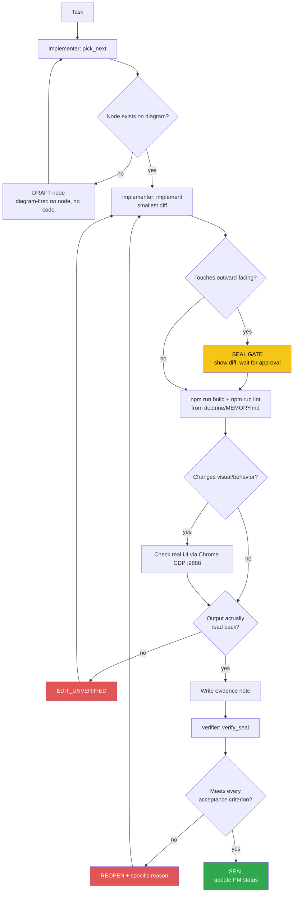

<!-- Diagram: dev-loop -->
<!-- Dev loop: plan - implement - verify - seal -->
DNA: 'smallest_diff / edit_x_read_back_proof_x_independent_verdict'
Auth: 65537 | Version: 1.0.0
Law: LAI-13 - monotonic ratchet (PENDING -> IN_PROGRESS -> SEALED, never demote)

> Every change to the repo's code enters here and leaves as SEALED or
> REOPENED — no state in between.

## PM status
> Older SEALED nodes (2026-08-16 through 2026-08-19, then a 2nd pass
> 2026-08-31 covering 5 more nodes dated 2026-08-25/2026-08-29) moved to
> `haven/diagrams/dev-loop-archive.md` to keep this file small — every
> worker session reads this file in full. Nothing deleted: the archive
> has each row's full original text verbatim. The compact rows below
> point to it; open the archive only when you need the full story
> behind an old node. `pick_next` only needs non-archived rows. Run
> `/hub-tokens` periodically — if this file flags >15KB again, repeat
> this archiving pass for nodes older than the current work session.

| Node | State | Notes |
|---|---|---|
| `i18n-page-content` | SEALED | 2026-08-25 — archived, see `haven/diagrams/dev-loop-archive.md`. Evidence: `evidence/implementer/2026-08-25/i18n-page-content-{plan,diff}.md`. |
| `open-to-work-badge` | SEALED | 2026-08-29 — archived, see `haven/diagrams/dev-loop-archive.md`. Evidence: `evidence/implementer/2026-08-29/open-to-work-badge-{plan,diff}.md`. |
| `open-to-work-badge-i18n` | SEALED | 2026-08-29 — archived, see `haven/diagrams/dev-loop-archive.md`. Evidence: `evidence/implementer/2026-08-29/open-to-work-badge-i18n-{plan,diff}.md`. |
| `blog-posts-shape-fix` | SEALED | 2026-08-29 — archived, see `haven/diagrams/dev-loop-archive.md`. Evidence: `evidence/implementer/2026-08-29/blog-posts-shape-fix-{plan,diff}.md`. |
| `remove-dead-related-articles` | SEALED | Dead-code cleanup (issue #88): deleted `themes/portfolio-dev/pages/post/RelatedArticles.vue` — 0 references anywhere in the codebase (`grep -rn "RelatedArticles"` and `grep -rn "ThemePostRelatedArticles"` both 0 matches, confirmed before deleting). Was leftover placeholder markup from a Flowbite example ("Volosoft", `href="#"` links, hardcoded `gray-50`/`gray-800` not using any `--theme-*` token — would have broken light/dark mode if it were ever rendered). First flagged in `giscus-comment`'s (issue #74) "Noticed, not done". Verified: build/lint clean (32 problems, 0 errors, unchanged — independently re-run by the verifier from a cold cache, exact match) + CDP independently re-verified with a fresh script/port on a real `/blogs/<id>` page — real content still renders, no trace of the deleted placeholder ("Volosoft" absent), 0 console errors. Issue #88, branch `feature/88`. Evidence: `evidence/implementer/2026-08-30/remove-dead-related-articles-{plan,diff}.md`, `evidence/verifier/2026-08-30/remove-dead-related-articles-seal.md`. |
| `dependency-upgrade-plan` | SEALED | Audit + plan only (issue #91): confirmed `npm audit`'s real `53 vulnerabilities (4 low, 8 moderate, 35 high, 6 critical)`, confirmed `npm audit fix` (no `--force`) resolves nothing. Classified root cause: only `unhead`/`@unhead/vue` (moderate, XSS bypass in `useHeadSafe`) is genuinely runtime-reachable (direct from `nuxt`, used via `useHead`/`useSeoMeta`) — the rest (`undici`, `koa`, `tar`, `vite`/`esbuild`/`rollup`, `@nuxt/devtools`, etc.) trace to Nuxt's own build/dev tooling, never shipped in `.output/server`. Key finding: `npm outdated`'s cached `nuxt` numbers were stale (showed `3.17.7`, live `npm view "nuxt@^3.13.0" version` shows the true range-max is `3.21.11`) — cross-checked `@nuxt/ui`/`@nuxt/image` and found those accurate, so it was `nuxt`-specific, not systemic. Wrote `DEPENDENCY-UPGRADE-PLAN.md` (repo root): Phase 1 (same-major patch/minor, `nuxt`→3.21.11 as the highest-value single bump since it fixes the one real-runtime advisory), Phase 2 (same-major, re-verify live first: `@nuxt/icon`/`@nuxt/image`/`@nuxt/ui`), Phase 3 (majors, one issue per row: `@nuxtjs/i18n` 10.x flagged as the already-failed trap from #75, `@nuxt/ui`+`tailwindcss` v4 bundled together, `pinia`+`@pinia/nuxt`, `puppeteer-core` needing its own research since `npm audit`'s own suggestion is a downgrade, `vue-router` deferred to a future Nuxt 4 migration). No dependency was actually bumped — pure audit + plan, exactly as issue #91 scoped it ("không làm gộp 1 lần"). Verified: build/lint clean (32 problems, 0 errors, 32 warnings, unchanged baseline — independently re-run by the verifier from a cold cache + fresh `.nvmrc`-resolved shell) + every cited number (audit count, live `nuxt` version) independently re-confirmed. No CDP needed — docs-only, no runtime/visual change. Issue #91, branch `feature/91`. Evidence: `evidence/implementer/2026-08-30/dependency-upgrade-plan-{plan,diff}.md`, `evidence/verifier/2026-08-30/dependency-upgrade-plan-seal.md`. |
| `add-nvmrc` | SEALED | Dev-tooling fix (issue #89): added `.nvmrc` (content `24`) at the repo root so a bare `nvm use` resolves to a Node version that satisfies `eslint-flat-config-utils@3.2.0`'s `Object.groupBy` requirement, instead of relying on manually remembering `nvm use 24` every session (the trap already recorded in `doctrine/domains/PROJECT.md`'s Traps table). `24` chosen over `lts/*` because it's already installed locally and matches the exact version prior verifier passes used. No `engines` field added — issue only asked for `.nvmrc` (`SmallestDiff`), tracked as a possible follow-up. Verified: cold-cache build clean (exit 0) + lint clean under the `.nvmrc`-resolved version (`✖ 32 problems (0 errors, 32 warnings)`, unchanged baseline — independently re-run by the verifier in a fresh shell, exact match). No CDP needed — `.nvmrc` is local dev tooling, no runtime/visual behavior changed. Issue #89, branch `feature/89`. Evidence: `evidence/implementer/2026-08-30/add-nvmrc-{plan,diff}.md`, `evidence/verifier/2026-08-30/add-nvmrc-seal.md`. |
| `readme-refresh` | SEALED | 2026-08-29 — archived, see `haven/diagrams/dev-loop-archive.md`. Evidence: `evidence/implementer/2026-08-29/readme-refresh-{plan,diff}.md`. |
| `centralize-color-tokens` | SEALED | 2026-08-16 — archived, see `haven/diagrams/dev-loop-archive.md`. Evidence: `evidence/implementer/2026-08-16/centralize-color-tokens-{plan,diff}.md`. |
| `editor-dracula-scope` | SEALED | 2026-08-16 — archived, see `haven/diagrams/dev-loop-archive.md`. Evidence: `evidence/implementer/2026-08-16/editor-dracula-scope-{plan,diff}.md`. |
| `light-theme-code-syntax-contrast` | SEALED | 2026-08-16 — archived, see `haven/diagrams/dev-loop-archive.md`. Evidence: `evidence/implementer/2026-08-16/light-theme-code-syntax-contrast-{plan,diff}.md`. |
| `light-theme-elevation` | SEALED | 2026-08-16 — archived, see `haven/diagrams/dev-loop-archive.md`. Evidence: `evidence/implementer/2026-08-16/light-theme-elevation-{plan,diff}.md`. |
| `resume-adapter-class` | SEALED | 2026-08-16 — archived, see `haven/diagrams/dev-loop-archive.md`. Evidence: `evidence/implementer/2026-08-16/resume-adapter-class-{plan,diff}.md`. |
| `resume-data-models` | SEALED | 2026-08-16 — archived, see `haven/diagrams/dev-loop-archive.md`. Evidence: `evidence/implementer/2026-08-16/resume-data-models-{plan,diff}.md`. |
| `giscus-comment` | SEALED | 2026-08-19 — archived, see `haven/diagrams/dev-loop-archive.md`. Evidence: `evidence/implementer/2026-08-19/giscus-comment-{plan,diff}.md`. |
| `giscus-live-fix` | SEALED | 2026-08-19 — archived, see `haven/diagrams/dev-loop-archive.md`. Evidence: `evidence/implementer/2026-08-19/giscus-live-fix-{plan,diff}.md`. |
| `i18n-foundation` | SEALED | 2026-08-19 — archived, see `haven/diagrams/dev-loop-archive.md`. Evidence: `evidence/implementer/2026-08-19/i18n-foundation-{plan,diff}.md`. |
| `rss-sitemap-feed` | SEALED | 2026-08-19 — archived, see `haven/diagrams/dev-loop-archive.md`. Evidence: `evidence/implementer/2026-08-19/rss-sitemap-feed-{plan,diff}.md`. |
| `dependency-upgrade-phase1` | SEALED | Executes Phase 1 of `DEPENDENCY-UPGRADE-PLAN.md` (issue #129): same-major patch/minor bumps to `nuxt` (3.13.2→3.21.11 — the highest-value bump, closes the one real-runtime advisory, `unhead`/`@unhead/vue`'s XSS bypass in `useHeadSafe`), plus `postcss`, `@iconify-json/fe`, `@iconify-json/grommet-icons`, `@nuxt/eslint`, `@vue/runtime-core`, `autoprefixer`, `dotenv`, `sass`+`sass-embedded` (matched pair), `typescript`, `vue-tsc`. Live-verified every target version via `npm view <pkg>@<range> version` immediately before bumping (not trusting a cached `npm outdated`). `npm audit`: 53 → 25 vulnerabilities; `unhead` no longer appears in the report at all, confirmed via `npm ls unhead @unhead/vue` (now `@unhead/vue@2.1.17`, brought in transitively by `nuxt`). `puppeteer-core` deliberately excluded (its only `npm audit fixAvailable` suggestion is a downgrade — tracked separately in Phase 3). Verified: build + lint independently re-run clean from cold cache (`npm run build` exit 0 no errors; `npm run lint` → `32 problems (0 errors, 32 warnings)`, exact match to baseline) + `npm audit`/`npm ls unhead @unhead/vue` independently reproduced verbatim + CDP independently re-verified with a fresh script/port (3993, different route than the implementer's check) — 0 console errors, 0 hydration warnings, real click-nav confirmed. Evidence: `evidence/implementer/2026-09-02/dependency-upgrade-phase1-{plan,diff}.md`, `evidence/verifier/2026-09-02/dependency-upgrade-phase1-seal.md`. |
| `visit-tracking-client-call` | SEALED | New client-only plugin (`plugins/VisitTracker.client.ts`) POSTs to the backend's new `POST /api/me/:email/visit` endpoint (resume-nodejs-api's `add-visit-tracking` node, branch `feat/visit-tracking`, not yet merged/deployed) on real page load, so the backend sees the real visitor IP/geo. Fire-and-forget, never blocks rendering; independently confirmed via CDP that a real SPA nav click doesn't re-fire the request. Verified: build/lint clean (32 problems, 0 errors, unchanged — independently re-run by the verifier from a cold cache) + CDP independently re-verified with a fresh script/port, plus a stronger real-click SPA-nav check. Production backend doesn't have the route live yet (branch not merged/deployed) — expected 404s, disclosed, not a bug here. Evidence: `evidence/implementer/2026-09-01/visit-tracking-client-call-{plan,diff}.md`, `evidence/verifier/2026-09-01/visit-tracking-client-call-seal.md`. |
| `dependency-upgrade-phase2` | SEALED | Issue #135: Phase 2 of `DEPENDENCY-UPGRADE-PLAN.md` — same-major bumps `@nuxt/icon` (`^1.5.6`→`^1.15.0`), `@nuxt/image` (`^1.8.0`→`^1.11.0`), `@nuxt/ui` (`^2.18.6`→`^2.22.3`), live-verified against the registry immediately before bumping (no drift from the 2026-08-30 plan doc). `#136` was found already resolved beforehand — no node created for it, per `pick_next`'s "no PENDING node" branch. `npm audit`: 25→18 vulnerabilities (side effect of transitive movement, not targeted). New `sharp` darwin-arm64 binary warning at build time (pulled in transitively by the `@nuxt/image` bump) confirmed via A/B not to break real image rendering — `ipx`'s JS fallback still serves both local and remote images correctly. Verified: build + lint independently re-run clean from a cold cache (`npm run build` exit 0, same `sharp` warning reproduced verbatim; `npm run lint` → `32 problems (0 errors, 32 warnings)`, exact baseline match) + `npm audit` count independently reproduced (`18 vulnerabilities (1 low, 2 moderate, 14 high, 1 critical)`, exact match) + CDP independently re-verified with a fresh script/port (3995, different from the implementer's 3994) — real click-based SPA nav to `/github` and `/blogs` confirmed working, `@nuxt/icon` icons rendering (25 `.iconify` spans on `/`), `@nuxt/ui`'s `UPagination` rendering on `/blogs` (numbered nav button), local `Avatar.png` via `ipx` and the remote GitHub avatar both loaded (`complete: true`), 0 console errors. Issue #135, no branch yet (evidence-only pass, per this repo's `/todo` flow — branching happens at PR time, not verify time). Evidence: `evidence/implementer/2026-09-05/dependency-upgrade-phase2-{plan,diff}.md`, `evidence/verifier/2026-09-05/dependency-upgrade-phase2-seal.md`. |
| `editor-dracula-badge-label-fix` | SEALED | Issues #137+#138: `themes/portfolio-dev/pages/projects/Index.vue`'s literal `text-blue-400` project-label (#137) and `<UBadge>` tech-tag (#138, via a per-instance `:ui` override, not a global `app.config.ts` change) now both follow `--theme-accent` inside the Dracula editor-scope. Key finding independently re-confirmed: Nuxt UI's `ui` prop merges via `defuTwMerge` per class-modifier group, so a non-dark-only override (`text-theme-accent ring-theme-accent/40`) leaves Nuxt UI's default `dark:text-primary-400`/`dark:ring-primary-400` classes surviving in dark mode — fixed by also adding explicit `dark:text-theme-accent`/`dark:ring-theme-accent/40` to the override. Verified: build clean (fresh cold-cache `npm run build`, independently re-run, exit 0, same pre-existing darwin-arm64 `sharp` warning, not new) + lint clean (`32 problems (0 errors, 32 warnings)`, independently re-run, exact baseline match) + CDP independently re-verified with a fresh script/port (3997, different from the implementer's 3996) on `/projects` in both color modes via a real click on the header's toggle — dark: label/badge `rgb(189, 147, 249)` (`#bd93f9`, Dracula Purple), light: `rgb(124, 58, 204)` (Dracula-light companion), `className` on the real rendered badge `` contains both `text-theme-accent` and `dark:text-theme-accent`/`dark:ring-theme-accent/40` with 0 `primary`/`blue` remnants in either mode, 0 console errors — independently confirms the implementer's `dark:`-prefix investigation dead-end was real and is fixed. Scope check: `git diff -- themes/portfolio-dev/pages/projects/Index.vue agent-hub/haven/diagrams/dev-loop.prime-mermaid.md` matches the diff note exactly, no other file touched by this node. Issues #137/#138, branch `feature/137-138`. Evidence: `evidence/implementer/2026-09-05/editor-dracula-badge-label-fix-{plan,diff}.md`, `evidence/verifier/2026-09-05/editor-dracula-badge-label-fix-seal.md`. |

| `editor-dracula-github-item-fix` | SEALED | Issue #145: `themes/portfolio-dev/pages/github/part/Item.vue`'s literal `text-blue-400` `homepage` link (line 9) and its topics `<UBadge>` (line 59+68, via a per-instance `:ui` override, not a global `app.config.ts` change) now both follow theme tokens inside the Dracula editor-scope. Deliberate deviation from #145's literal suggestion, recorded and independently re-verified: used `text-theme-code-keyword` (NOT `text-theme-accent`) on the `homepage` link because the adjacent `html_url` link already uses `text-theme-accent` — reusing it for both would collapse the 2 links to 1 visual color; `--theme-code-keyword` is a byte-for-byte match of the literal `blue-400`/`blue-600` being replaced in non-Dracula modes (`grep` on `settings-colors-theme/*.css` confirmed `96 165 250`/`37 99 235`), independently re-confirmed by this verifier pass, and still a distinct Pink from `--theme-accent`'s Purple inside Dracula. `<UBadge>` reuses the exact `techBadgeUi` pattern already proven and sealed in `projects/Index.vue` (incl. explicit `dark:` variants, required by `defuTwMerge`'s per-modifier-group merge). Verified: lint independently re-run clean (`32 problems (0 errors, 32 warnings)`, exact baseline match) + build audited from the note (cited exit 0, cold-cache, matches `doctrine/MEMORY.md`'s command, not re-run — not outward-facing/release-gate per `verify_seal.md`'s Re-run scope) + CDP independently re-verified with a fresh script/port (3999, different from the implementer's 3998) on `/github` in both color modes via a real click on the header's toggle — dark: `homepage` `rgb(255, 121, 198)` (`#ff79c6` Dracula Pink) vs `html_url` `rgb(189, 147, 249)` (Dracula Purple, distinct); light: `homepage` `rgb(219, 42, 142)` vs `html_url` `rgb(124, 58, 204)` (distinct); topic badge ("nuxt", on repo `datvt243.github.io`) `className` contains both `text-theme-accent` and `dark:text-theme-accent`/`dark:ring-theme-accent/40` with 0 `primary`/literal-blue remnants in either mode, 0 console errors. Scope check: `git diff --stat` matches the diff note exactly (`Item.vue` + this diagram row only), no other file touched. Issue #145, branch `feature/145`. Evidence: `evidence/implementer/2026-09-06/editor-dracula-github-item-fix-{plan,diff}.md`, `evidence/verifier/2026-09-06/editor-dracula-github-item-fix-seal.md`. |

| `enforce-node-engines` | SEALED | Issue #140: added `"engines": { "node": ">=24", "npm": ">=11" }` to `package.json` (right after `"type": "module"`, before `"scripts"`) so the known npm-10.8.2 arborist bug (`TypeError: ... edgesOut`) can't silently bite an `npm install` run under an older default Node when a developer skips `nvm use` first; `npm >=11` matches issue #140's own "Why" section (the exact fix boundary for the arborist bug), not independent scope creep. `package-lock.json` auto-synced (4-line addition, not manual). `.npmrc`'s `engine-strict` intentionally NOT added — issue marks it optional, `SmallestDiff`. Verified: build independently re-run clean (cold, exit 0, same pre-existing darwin-arm64 `sharp` warning, not new) + lint independently re-run clean (`32 problems (0 errors, 32 warnings)`, exact baseline match) + `.nvmrc` (`24`) confirmed consistent with the new `engines.node` floor + this verifier's own `node -v`/`npm -v` (`v24.19.0`/`11.17.0`) independently confirmed to satisfy the new range + `npm install` independently re-run under that Node/npm: exit 0, `up to date, audited 1281 packages`, no `EBADENGINE`/arborist error, `package-lock.json` diff still exactly the same 4 lines after re-run (no extra drift). No visual/behavior change, no CDP needed. Scope check: `git diff --stat` for this node is exactly `package.json` + `package-lock.json` + this diagram row — the concurrent `editor-dracula-github-item-fix` node (issue #145, separately SEALED the same day) was split into its own commit on `feature/145`, not part of this branch. Issue #140, branch `feature/140`. Evidence: `evidence/implementer/2026-09-06/enforce-node-engines-{plan,diff}.md`, `evidence/verifier/2026-09-06/enforce-node-engines-seal.md`. |

| `blog-api-runtime-validation` | SEALED | Issue #141: added `server/utils/blogSchemas.ts` — zod schemas (`postSchema`, `paginatedPostsSchema`, `categorySchema`/`categoriesSchema`, `apiFormatResponseSchema` wrapper) + `parseBlogApiResponse()` helper that throws `createError({ statusCode: 502, ... })` (same pattern as the existing `server/api/generate-pdf.ts`) on a shape mismatch instead of silently propagating an undefined/wrong-shaped value. Wired into all 3 blog-API boundary points: `server/utils/cacheGetPost.ts` (posts list), `server/api/blogs/detail/[id].ts` (post detail), `server/api/blogs/categories.ts` (categories). `zod` added to `dependencies` (resolved to `3.25.76`, deduped against `@nuxt/ui`'s own zod dependency already in the tree — not a new major version). Key finding from testing against the REAL live external API (not just the existing TS types): `Post.isPublic` (in `types/blog.ts`) was already inaccurate — the real API never returns it (confirmed via direct `curl` against `blog-api-nodejs-express.onrender.com`) and nothing in the app reads `post.isPublic` (`grep -rn "isPublic"` across `themes/`/`stores/`/`pages/`: 0 matches) — fixed `types/blog.ts` to make it optional, matching reality, since a strict runtime schema built on the old (wrong) required type would have 502'd on every real post. Similarly, `server/api/blogs/categories.ts`'s prior `APIFormatResponse<string[]>` cast was already wrong — the real API returns full category objects (`_id`/`name`/`slug`/`description`), matching what the real consumer (`themes/portfolio-dev/components/PostCategories.vue`'s own `Category` interface) already expected — schema follows the real shape, not the stale cast. Verified: build clean (cold cache, exit 0, same pre-existing darwin-arm64 `sharp` warning, not new) + lint clean (`30 problems (0 errors, 30 warnings)` — 2 FEWER than the 32-warning baseline: removing the now-unused `errors`/`message` destructure in `categories.ts` also removed 2 pre-existing unused-var warnings, not a regression) + real UI verified via Chrome CDP (`/blogs` renders 9 real post links + categories sidebar with 0 errors; real click-based SPA nav into a real post via its actual `_id`-based route renders full title/author/date/content; 0 errors on any `/api/blogs/*` response; the only captured console error was an unrelated giscus third-party widget network abort) + all 3 endpoints independently re-curled directly against `http://localhost:3000` after the fix, confirming 0 false 502s against real live data. Issue #141, no branch yet (evidence-only pass so far, branching happens at PR time per this repo's `/todo` flow). Evidence: `evidence/implementer/2026-09-06/blog-api-runtime-validation-{plan,diff}.md`. Independently re-verified by a separate blank-context verifier pass (2026-09-07): `npm run build` (exit 0, `✨ Build complete!`, same pre-existing darwin-arm64 `sharp` warning) and `npm run lint` (exit 0, `✖ 30 problems (0 errors, 30 warnings)`, exact match) both independently re-run clean; all 3 live endpoints (`/post/`, `/post/detail/<id>`, `/categories`) independently `curl`'d fresh against `https://blog-api-nodejs-express.onrender.com` (not a re-read of the implementer's cited output) and their real JSON parsed directly through the actual `postSchema`/`paginatedPostsResponseSchema`/`postResponseSchema`/`categoriesResponseSchema` exports via a `jiti`-loaded scratch script — all 3 `safeParse` successfully with 0 issues; a sanity variant of `postSchema` with `isPublic` forced required was independently shown to REJECT the same real post payload (`Required` at `path: ["isPublic"]`), concretely proving the node's core claim that the old required-`isPublic` TS type didn't match the real external API's shape while the new optional zod schema does. Evidence: `evidence/verifier/2026-09-07/blog-api-runtime-validation-seal.md`. |

Any regression must be a **new node** (LAI-13) — never edit an old node's
PM status directly to "undo" an existing SEAL.
